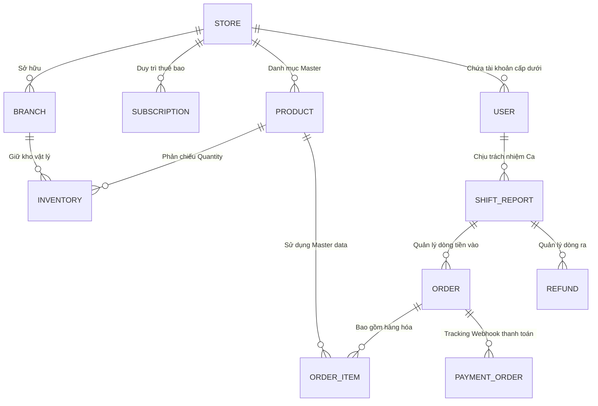

# TÀI LIỆU ĐẶC TẢ HỆ THỐNG VÀ KIẾN TRÚC KỸ THUẬT TOÀN DIỆN (SRS & SYSTEM ARCHITECTURE) - SaaS MyPos

---

## MỤC LỤC
1. [Giới Thiệu Dự Án](#1-giới-thiệu-dự-án)
2. [Cấu Trúc Công Nghệ & Hạ Tầng](#2-cấu-trúc-công-nghệ--hạ-tầng)
3. [Luồng Nghiệp Vụ Chuyên Sâu (Business Flows)](#3-luồng-nghiệp-vụ-chuyên-sâu-business-flows)
4. [Phân Quyền Hệ Thống & Vai Trò (RBAC Actor Analysis)](#4-phân-quyền-hệ-thống--vai-trò-rbac-actor-analysis)
5. [Kiến Trúc Cơ Sở Dữ Liệu Thực Thể (Database Schema)](#5-kiến-trúc-cơ-sở-dữ-liệu-thực-thể-database-schema)
6. [Cấu Trúc API Cốt Lõi (Core API Design)](#6-cấu-trúc-api-cốt-lõi-core-api-design)
7. [Kiến Trúc Frontend & State Management](#7-kiến-trúc-frontend--state-management)
8. [Quy Trình Trải Nghiệm Người Dùng Cuối (User Journey)](#8-quy-trình-trải-nghiệm-người-dùng-cuối-user-journey)
9. [Hướng Dẫn Triển Khai (Deployment Guide)](#9-hướng-dẫn-triển-khai-deployment-guide)

---

## 1. Giới Thiệu Dự Án
**MyPos** là dự án Hệ Thống Quản Lý Điểm Bán Hàng (POS - Point of Sale) thiết kế dành riêng cho mô hình Phần mềm như một Dịch vụ (SaaS). 
Dự án được xây dựng với mục tiêu giúp các Nhà bán lẻ (từ quy mô cửa hàng nhỏ lẻ đến chuỗi siêu thị/thời trang đa điểm) sở hữu một công cụ quản lý doanh số, tồn kho, khoá ca làm việc của thu ngân và quản lý phân quyền số hóa thay vì các công cụ thủ công truyền thống. Bản chất hệ thống cho phép **Multi-Tenancy** ở mức dữ liệu (Mỗi cửa hàng là 1 Tenant với Store ID độc lập).

---

## 2. Cấu Trúc Công Nghệ & Hạ Tầng

Hệ thống được phát triển theo mô hình Client-Server rời rạc:

### 2.1 Backend Core (Lõi Dữ Liệu & Logic)
*   **Java 17 & Spring Boot 3.x**: Xương sống xử lý tốc độ cao và đáng tin cậy. Dễ dàng auto-configure các gói thư viện.
*   **Spring Security & JWT**: Áp dụng cho luồng xác thực và phân quyền Stateless mà không cần theo dõi Session Object trên cấu hình server, giảm tải Memory.
*   **Spring Data JPA & Hibernate**: Tương tác với DB dạng ORM (Object Relational Mapping).
*   **MySQL & H2 Database**: H2 (Base file lưu tại /data/) ưu tiên cho Dev/Staging để giảm tải hạ tầng, MySQL chuyên về Production.
*   **Cloudinary Integration**: Xử lý upload và render ảnh sản phẩm, Logo, nén tự động để giảm tải băng thông.
*   **Payment Gateways**: Codebase bọc sẵn thư viện Razorpay/Stripe; tích hợp API bên thứ 3 quét mã QR nội địa.

### 2.2 Frontend Core (Giao Diện Chức Năng)
*   **React 18 & Vite**: Cơ chế HMR siêu tốc khi dev, render Component Virtual DOM nhạy bén (thích hợp thao tác máy thu ngân vội vã).
*   **Redux Toolkit (RTK)**: Thao tác Global State quản lý Dữ liệu người dùng, cấu hình Store hiện tại và **Giỏ Hàng (Cart)**. Giải quyết triệt để Prop-drilling qua nhiều tầng màn hình.
*   **Tailwind CSS & Shadcn UI**: Hệ thống Utility-class tạo layout Grid chia đôi chuyên nghiệp. Shadcn UI cung cấp components không bị ràng buộc package (Headless UI) bảo đảm Data Flow.
*   **Recharts**: Thư viện Render SVG tạo biều đồ (Chart) Analytics, trực quan hoá KPI kinh doanh.

---

## 3. Luồng Nghiệp Vụ Chuyên Sâu (Business Flows)

Dự án sở hữu 4 lõi nghiệp vụ đinh (Core Logics) quyết định sự toàn vẹn của nền tảng:

### 3.1 Nghiệp Vụ Subscription & Rào Cản Định Tuyến (SaaS Tenant Workflow)
1. **Quản lý Hạn mức Plan:** `SubscriptionPlan` được config các ngưỡng kịch trần (maxUsers, maxBranches, maxProducts).
2. **Middleware Ngăn chặn:** Logic của Tầng Service, bất cứ lúc nào REST API `POST Products/Branches/Employees` được kích hoạt, hệ thống Query xuống DB chạy phép đếm COUNT đối chiếu Threshold (Ngưỡng hạn mức). Nếu vượt ngưỡng, lập tức quăng `UserException` -> Thông báo Front-end bật Popup Upgrade Nâng cấp Package.

### 3.2 Nghiệp Vụ Quản Trị Tích Hợp Kho - Bán Hàng (Inventory vs POS Sales)
1. Do đặc thù đa chi nhánh, **Sản Phẩm (Product)** là thực thể đứng chung (Master), trong khi **Tồn Kho (Inventory)** là thực thể tách riêng chẻ nhỏ về các Nhánh (Branch).
2. Khi giao dịch POS diễn ra: Khách chọn mặt hàng A (Số lượng 2). Thu ngân tạo `Order`.
3. Hệ thống sinh vòng lặp duyệt qua `OrderItem`, gọi Inventory Service, Query đúng khóa chính tổ hợp ID (`BranchId` + `ProductId`). THỰC THI Phép tính trừ: `UPDATE inventory SET quantity = quantity - 2`. Hành động Trigger Validation nếu âm kho sẽ ROLLBACK Transaction qua `@Transactional`. Ngăn chặn lạm thu hàng.

### 3.3 Nghiệp Vụ Khoá Sổ Ca Làm Việc (Shift Report Engine)
Vũ khí chống gian lận lớn nhất của MyPos.
1. Khác với Web Ecommerce thông thường, máy vạch POS yêu cầu tính liên tục. Mở màn hình POS, hệ thống yêu cầu nhấn **"Bắt đầu ca"** (Start Shift). Một ID Mẹ (Shift ID) được sinh ra bọc lấy User định danh (`cashierId`) với mốc `shiftStart` thời gian thực. Báo cáo này Status = ON_GOING.
2. Từ giây phút này trở đi, thu ngân Bán hay Hoàn trả 1000 đơn hàng thì hệ thống tự động Stamp (In dấu) `shift_report_id` vào toàn bộ thực thể.
3. Nhấn **"Đóng ca"** (End Shift): Thuật toán đếm gom: 
   - Tổng Doanh số gộp (`totalSales`)
   - Bồi Hoàn trừ lại (`totalRefunds`).
   - Rút gọn Net Doanh Thu Thực (`netSales`).
   Lưu vĩnh viễn dữ liệu xuống DB giúp chủ cửa hàng đối soát rạch ròi.

### 3.4 Nghiệp Vụ Xử Lý Rollback & Hoàn Tiền (Refunds Mechanism)
1. Một lệnh hoàn tiền gọi `POST /api/refunds/`. Lệnh này bị Validate nếu không chọn 1 `Order` gốc.
2. Khoá vào Ca hiện hành. Trữ lượng Kho (Quantity Inventory) được Kích hoạt Cộng Trở Lại. Trạng thái Đơn đổi về Hoàn.
3. Doanh thu luồng Shift Bị trừ hao. 

---

## 4. Phân Quyền Hệ Thống & Vai Trò (RBAC Actor Analysis)

Hệ thống dựa vào String Enum `UserRole`. Security Config cản chặn qua Annotations `@PreAuthorize` và filter JWT:

| Vai Trò Phân Cấp | Định Danh Enum | Trách Nhiệm Vận Hành & Quyền Hạn |
| :--- | :--- | :--- |
| **Super Admin** | `ROLE_ADMIN` | Vận hành máy chủ SaaS gốc. Quản trị các Subscription Plans (Gói bán) giá cả của Platform. Quản trị vòng đời Store (Có thể Ban/Khóa các Cửa hàng không trả phí). |
| **Store Admin** | `ROLE_STORE_ADMIN`/`_MANAGER`| Thôn tính các Chi nhánh trong công ty. Quản lý toàn bộ danh sách chi nhánh, Khởi tạo Sản phẩm, Theo dõi báo cáo của TẤT CẢ các chi nhánh. Setup Subcription. |
| **Branch Manager**| `ROLE_BRANCH_ADMIN`/`_MANAGER`| Đốc công 1 Chi nhánh Vật lý riêng biệt. Nhập xuất chỉnh sửa Số tồn kho thực tế ở nơi đó (Inventory Cục bộ). Xem báo cáo Sales của chỉ chi nhánh đó quản lý. |
| **Cashier** | `ROLE_CASHIER` | Tướng đánh trận. Màn hình duy nhất là máy bắn Mã Vạch POS / Danh sách Sản phẩm tại màn Split-View. Mở Shift, tính tiền Order, và Đóng Shift. In hóa đơn. |

---

## 5. Kiến Trúc Cơ Sở Dữ Liệu Thực Thể (Database Schema)

Dữ liệu tuân theo Quy chuẩn Normalization cao:

**Mô tả các Bảng Cốt Lõi:**
*   `stores`: Có `status` enum (PENDING, ACTIVE, BANNED), và liên kết ngoại ngầm định mọi dữ liệu Master của App.
*   `users`: Tập trung hoá. Lệnh truy vết cấp quyền qua `role`. (Ví dụ: `ROLE_CASHIER` thì ID Branch không được Null).
*   `subscription_plans`: Quản lý Meta Fields cản giới hạn: `maxUsers`, `maxBranches`, `price`.
*   `orders`: Mang `totalAmount`, Link móc nối `cashier`, `branch` nơi giao dịch. 

---

## 6. Cấu Trúc API Cốt Lõi (Core API Design)

Chuỗi Endpoint thiết kế theo chuẩn REST Data/JSON MapStruct:

**Xác thực bảo mật:**
*   `POST /auth/signup`: Đăng kí Account Store gốc. 
*   `POST /auth/login`: Lấy Token JSON `AuthResponse`. Reset mật khẩu qua Link Forgot (`/auth/forgot-password`).

**Kiểm Soát Nhánh & Kho (Admin / Branch Control):**
*   `GET/POST /api/stores`, `.../branches/{storeId}`
*   `GET/PUT /api/inventories/{branchId}`: Update con số lượng hàng tại nhánh A. Bắn Request Check Low Stock.
*   `POST /api/employees/store/{storeId}`: Khởi tạo Manager hoặc Cashier.

**Bán Hàng POS (Cashier Side):**
*   `POST /api/shift-reports/start`: Khai sinh 1 Shift Data qua Cache.
*   `POST /api/orders`: Dispatch giỏ hàng Frontend thành 1 Ticket Order thật. Payload gồm mảng Item. Gọi Inventory Update.
*   `GET /api/orders/today/branch/{branchId}`: Load lại bill.
*   `POST /api/payments/create`: (Hỗ trợ webhook với Gateway).
*   `PATCH /api/shift-reports/end`: Rà Check-out sổ sách.

**Phân Tích Thống Kê (Analytics Chart Service):**
*   `GET /api/store/analytics/{adminId}/sales-trends`: Trả dữ liệu mảng TimeSeries Vẽ Chart Tháng.
*   `GET /api/branch-analytics/top-products`: Trả array KPI phần trăm nhóm Item đắt hàng.

---

## 7. Kiến Trúc Frontend & State Management

Cây Thư mục Frontend React `/src` và Flow phân đoạn:

**Cấu Trúc Pages (Không gian Thao tác độc lập):**
1.  **Dành cho Guest (`/onboarding`)**: Landing quảng cáo, Trang Đăng Ký, Trang Reset Pass. CSS Public Minimalist.
2.  **Dành cho Super Admin (`/SuperAdminDashboard`)**: Data Card Grid quản lý Tổng Store thuê bao, Cấu hình CMS Hệ thống.
3.  **Dành cho Store Admin (`/store`)**: Dashboard Tổng. Màn lưới Table Báo cáo Khẩn (Cảnh báo Hết Hàng liên chi nhánh).
4.  **Dành cho Branch Manager (`/Branch Manager`)**: Khung view Inventory Update trực diện. Biểu đồ thu nhỏ PieChart của chi nhánh đó.
5.  **Khu Màn Hình Lõi POS (`/cashier`)**: Split Layout Left-Right View.
    *   Sử dụng UI dạng thẻ Badge siêu rộng để cảm ứng chạm trên màn hình POS vật lí.
    *   Modal Popups dùng cho Thanh toán QR, quét xong bay thẳng tránh redirect Refresh Browser gây kẹt Ca.
    *   Component `RecentOrdersCard.jsx`: Gắn tại Màn Check-out In Bill Cuối Ca (`ShiftSummary`).

**Redux Toolkit (RTK) Global Store:**
Thay vì ném Prop liên miên, Redux chia làm các Slice rạch ròi:
*   `AuthSlice`: Lưu Bearer Token, Quyền User Role. Điều phối Protect Route.
*   `CartSlice`: Lưu Tạm các Product văng vào giỏ. Chứa logic `cộng (+) / trừ (-)` tự động tính nhẩm Sub-Total.
*   `ShiftSlice`: Trữ State xem nhân viên có đang vướng Ca dở dang không để khoá Màn hình POS lại nếu chưa bật Ca.

---

## 8. Quy Trình Trải Nghiệm Người Dùng Cuối (User Journey)

**Mô Phỏng Trải Nghiệm Chuỗi Dược Phẩm/MiniMart:**
1.  **Bước 1 (Mua Dịch Vụ SaaS)**: Chú Tám kinh doanh Siêu thị Mini 2 nhánh. Vào Web MyPos, Chọn **Package BASIC (Giá 500k/Tháng - 2 Branches)**. Thanh toán VNPay Online. Hệ thống MyPos cấp khởi tạo `STORE: Tám MiniMart`.
2.  **Bước 2 (Khai Báo Cổng Toàn Cục)**: Chú Tám đăng nhập StoreDashboard, dùng nút (+) Tạo 2 Chi nhánh A và B. Tạo thêm 2 acc Thu Ngân và phát cho NV. Tạo mặt hàng: "Sữa Chua Vinamilk".
3.  **Bước 3 (Nhập Kho Vật Lý)**: Quản lý chi nhánh A vào màn `/Branch Manager`, gán "Sữa Chua Vinamilk" số lượng Tồn = 50. Chi nhánh B gán = 100.
4.  **Bước 4 (Chuẩn Bị Giao Dịch)**: Thu ngân login ở màn hình máy quầy POS. Hiện nút to: **"MỞ CA SÁNG"**. Bấm nút. Hệ thống nhảy màn hình Máy bấm tiền quen thuộc.
5.  **Bước 5 (POS Flow)**: Khách bê 3 hộp sữa ra tính tiền. Thu ngân dùng súng Scan mã vạch (Hoặc search UI). Máy kêu tít tít hiện ra cột bên phải List Giỏ Hàng. Bấm "Thanh Toán VNQR". Màn hình iPad hiện QR. Khảo sát tài khoản, Thu Ngân chốt "Đã Thu Đủ". Máy In chạy biên lai ra Bill giấy.
6.  **Bước 6 (Luồng Báo Động)**: Chi nhánh A bán liền tù tì thêm 47 lon sữa nữa. Số lượng tụt về 0. Điện thoại Chú Tám văng Notification Đỏ Chót (Table Cảnh Báo LowStock). Kế hoạch nhập kho phát sinh.
7.  **Bước 7 (Khóa Sổ Cất Quỹ)**: Cuối ngày 10 PM. Thu nhân bấm **"KẾT THÚC CA"**. Màn hình tổng soát văng ra Popup: Có báo cáo hôm nay Bán được tổng 8 triệu đ, Hoàn đơn sai 1 triệu đ, Tổng thu 7 triệu. Ký xác thực đóng máy bảo chứng về DB.

---

## 9. Hướng Dẫn Triển Khai (Deployment Guide)

**Môi Trường Dev System (Backend - Local):**
1. Mở IDE (IntelliJ). Thay file `application.properties`: 
   * Active Profile Local (Ví dụ: Chuyển DB qua `jdbc:h2:file:/data/...` để chạy Local cực nhẹ và không cần cài MySQL Engine nặng máy).
   * Điền Key bí mật Cloudinary và Secret JWT Key.
2. Run `mvn spring-boot:run`. Tomcat chạy PORT `8080` / `5454`. Load OpenAPI Document tại localhost:5454/swagger-ui.

**Khởi Chạy Giao Diện (Frontend - Vite):**
1. Mở Terminal `cd Frontend`.
2. Chạy Lệnh `npm install` hoặc `pnpm i` để down Node Modules.
3. Thiết lập biến môi trường Base API vào file `.env` (Ví dụ `VITE_API_URL=http://localhost:5454`).
4. Khởi động UI: `npm run dev`. App React sẽ Spin Server tại Port `5173`. Truy cập qua Web Browser.

---
_Đây là phiên bản Đặc tả Tài Liệu Siêu Cấp (Ultimate Edition) của dự án MyPos, phân tích cặn kẽ mọi góc nhìn trong cấu trúc phần mềm_
