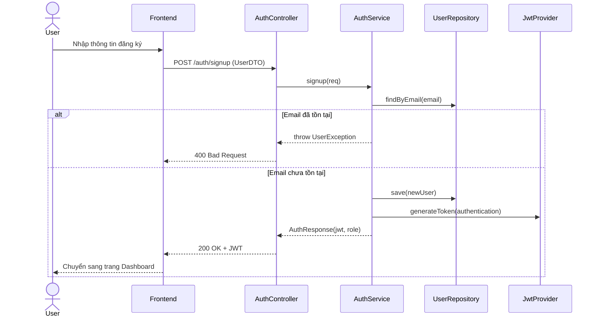
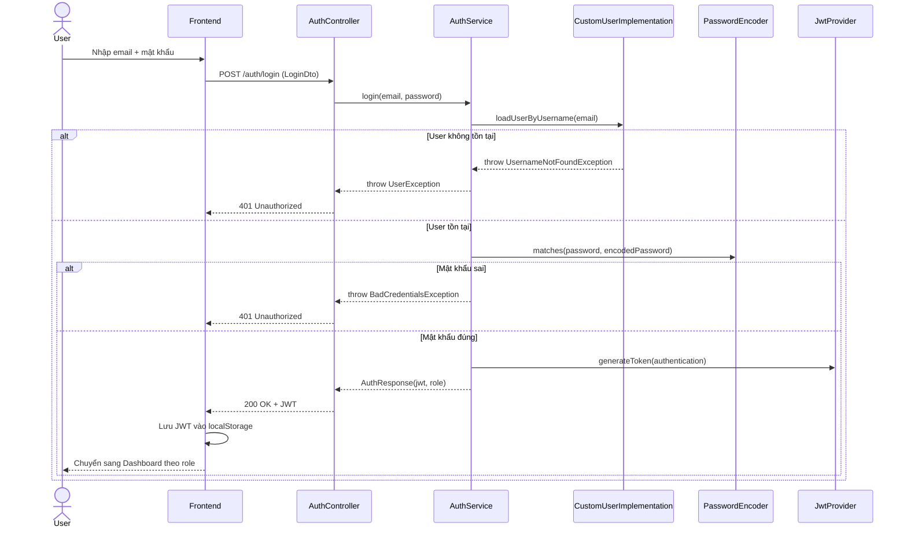
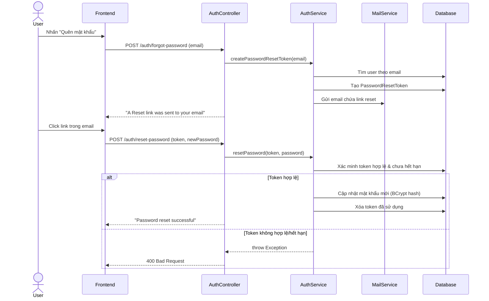

# TDD: Xác thực (Authentication)

## 1. Tổng quan

Module Xác thực chịu trách nhiệm xử lý toàn bộ quy trình đăng ký, đăng nhập, quên mật khẩu và đặt lại mật khẩu cho người dùng hệ thống DMart POS. Sử dụng JWT (JSON Web Token) cho cơ chế xác thực stateless.

**Controller:** `AuthController.java`
**Base URL:** `/auth`

---

## 2. API Endpoints

| # | Method | URL | Mô tả | Phân quyền |
|---|--------|-----|-------|------------|
| 1 | POST | `/auth/signup` | Đăng ký tài khoản mới | Public |
| 2 | POST | `/auth/login` | Đăng nhập | Public |
| 3 | POST | `/auth/forgot-password` | Yêu cầu đặt lại mật khẩu | Public |
| 4 | POST | `/auth/reset-password` | Đặt lại mật khẩu bằng token | Public |

---

## 3. Request / Response Schema

### 3.1 Đăng ký (POST `/auth/signup`)

**Request Body (`UserDTO`):**
```json
{
  "fullName": "Nguyễn Văn A",
  "email": "nguyenvana@email.com",
  "password": "SecureP@ss123",
  "role": "ROLE_STORE_ADMIN"
}
```

**Response (`ApiResponseBody<AuthResponse>`):**
```json
{
  "success": true,
  "message": "User created successfully",
  "data": {
    "jwt": "eyJhbGciOiJIUzI1NiJ9...",
    "role": "ROLE_STORE_ADMIN",
    "message": "Signup success"
  }
}
```

### 3.2 Đăng nhập (POST `/auth/login`)

**Request Body (`LoginDto`):**
```json
{
  "email": "nguyenvana@email.com",
  "password": "SecureP@ss123"
}
```

**Response (`ApiResponseBody<AuthResponse>`):**
```json
{
  "success": true,
  "message": "User logged in successfully",
  "data": {
    "jwt": "eyJhbGciOiJIUzI1NiJ9...",
    "role": "ROLE_STORE_ADMIN",
    "message": "Login success"
  }
}
```

### 3.3 Quên mật khẩu (POST `/auth/forgot-password`)

**Request Body (`ForgotPasswordRequest`):**
```json
{
  "email": "nguyenvana@email.com"
}
```

**Response (`ApiResponse`):**
```json
{
  "message": "A Reset link was sent to your email."
}
```

### 3.4 Đặt lại mật khẩu (POST `/auth/reset-password`)

**Request Body (`ResetPasswordRequest`):**
```json
{
  "token": "abc123-reset-token",
  "password": "NewSecureP@ss456"
}
```

**Response (`ApiResponse`):**
```json
{
  "message": "Password reset successful"
}
```

---

## 4. Database Schema

### 4.1 Bảng `users`

| Trường | Kiểu | Ràng buộc | Mô tả |
|--------|------|-----------|-------|
| id | BIGINT | PK, AUTO_INCREMENT | ID người dùng |
| full_name | VARCHAR(255) | NOT NULL | Họ và tên |
| email | VARCHAR(255) | NOT NULL, UNIQUE | Email đăng nhập |
| password | VARCHAR(255) | — | Mật khẩu (BCrypt hash) |
| phone | VARCHAR(20) | — | Số điện thoại |
| role | VARCHAR(50) | NOT NULL | Vai trò (enum UserRole) |
| store_id | BIGINT | FK → stores.id | Cửa hàng thuộc về |
| branch_id | BIGINT | FK → branches.id | Chi nhánh thuộc về |
| verified | BOOLEAN | NOT NULL, DEFAULT false | Trạng thái xác minh |
| last_login | DATETIME | — | Lần đăng nhập cuối |
| created_at | DATETIME | NOT NULL | Ngày tạo |
| updated_at | DATETIME | NOT NULL | Ngày cập nhật |

### 4.2 Bảng `password_reset_token`

| Trường | Kiểu | Ràng buộc | Mô tả |
|--------|------|-----------|-------|
| id | BIGINT | PK | ID token |
| token | VARCHAR(255) | UNIQUE | Token reset mật khẩu |
| user_id | BIGINT | FK → users.id | Người dùng sở hữu token |
| expiry_date | DATETIME | NOT NULL | Thời hạn hết hiệu lực |

---

## 5. Phân quyền

| Endpoint | ADMIN | STORE_ADMIN | STORE_MANAGER | BRANCH_ADMIN | BRANCH_MANAGER | CASHIER | CUSTOMER | Public |
|----------|:-----:|:-----------:|:-------------:|:------------:|:--------------:|:-------:|:--------:|:------:|
| POST /auth/signup | — | — | — | — | — | — | — | ✅ |
| POST /auth/login | — | — | — | — | — | — | — | ✅ |
| POST /auth/forgot-password | — | — | — | — | — | — | — | ✅ |
| POST /auth/reset-password | — | — | — | — | — | — | — | ✅ |

> Tất cả endpoints xác thực đều là **public** (không yêu cầu JWT token).

---

## 6. Sequence Diagram

### 6.1 Luồng Đăng ký



### 6.2 Luồng Đăng nhập



### 6.3 Luồng Quên & Đặt lại Mật khẩu



---

## 7. Nghiệp vụ Phụ thuộc

| Module | Quan hệ | Mô tả |
|--------|---------|-------|
| **User Management** | Trực tiếp | Tạo mới User entity khi đăng ký |
| **JWT Provider** | Trực tiếp | Tạo và xác thực JWT token |
| **Mail Service** | Trực tiếp | Gửi email reset mật khẩu |
| **Store Onboarding** | Gián tiếp | Sau đăng ký, Store Admin được chuyển sang flow tạo cửa hàng |

---

## 8. Error Handling

| HTTP Code | Lỗi | Mô tả | Trường hợp |
|-----------|------|-------|------------|
| 400 | `UserException` | Lỗi nghiệp vụ | Email đã tồn tại, dữ liệu không hợp lệ |
| 401 | `BadCredentialsException` | Xác thực thất bại | Sai email hoặc mật khẩu |
| 404 | `UserException` | Không tìm thấy | Email không tồn tại (forgot password) |
| 400 | `RuntimeException` | Token không hợp lệ | Token reset hết hạn hoặc không tồn tại |

---

## 9. Test Cases

### 9.1 Happy Path
| # | Test Case | Input | Expected Output |
|---|-----------|-------|-----------------|
| TC-01 | Đăng ký thành công | UserDTO hợp lệ (email mới) | 200 OK + JWT token |
| TC-02 | Đăng nhập thành công | Email + mật khẩu đúng | 200 OK + JWT token |
| TC-03 | Quên mật khẩu thành công | Email tồn tại | 200 OK + email gửi |
| TC-04 | Reset mật khẩu thành công | Token hợp lệ + mật khẩu mới | 200 OK |

### 9.2 Error Cases
| # | Test Case | Input | Expected Output |
|---|-----------|-------|-----------------|
| TC-05 | Đăng ký email trùng | Email đã tồn tại | 400 Bad Request |
| TC-06 | Đăng nhập sai mật khẩu | Email đúng + mật khẩu sai | 401 Unauthorized |
| TC-07 | Đăng nhập email không tồn tại | Email không tồn tại | 401 Unauthorized |
| TC-08 | Reset với token hết hạn | Token expired | 400 Bad Request |
| TC-09 | Đăng ký thiếu trường bắt buộc | Thiếu fullName/email | 400 Validation Error |

### 9.3 Edge Cases
| # | Test Case | Input | Expected Output |
|---|-----------|-------|-----------------|
| TC-10 | Đăng ký email viết hoa | "USER@EMAIL.COM" | Xử lý case-insensitive hoặc reject |
| TC-11 | Mật khẩu rỗng | password: "" | 400 Validation Error |
| TC-12 | Đăng nhập nhiều lần liên tục | 10 requests/giây | Rate limiting (nếu có) |

---

## 10. Deployment Notes

### 10.1 Biến môi trường
| Biến | Mô tả | Ví dụ |
|------|-------|-------|
| `JWT_SECRET` | Secret key cho JWT signing | `mySecretKey123456789...` |
| `JWT_EXPIRATION` | Thời gian sống của token (ms) | `86400000` (24h) |
| `SPRING_MAIL_HOST` | SMTP host cho gửi email | `smtp.gmail.com` |
| `SPRING_MAIL_USERNAME` | Email gửi | `noreply@dmart.com` |
| `SPRING_MAIL_PASSWORD` | App password | `****` |

### 10.2 Lưu ý
- JWT secret key phải đủ dài (≥ 256 bits) cho thuật toán HS256
- Mật khẩu người dùng được hash bằng BCrypt (strength = 10)
- Token reset mật khẩu có thời hạn giới hạn (thường 1 giờ)
- Frontend lưu JWT trong `localStorage` và gửi kèm header `Authorization: Bearer <token>`
