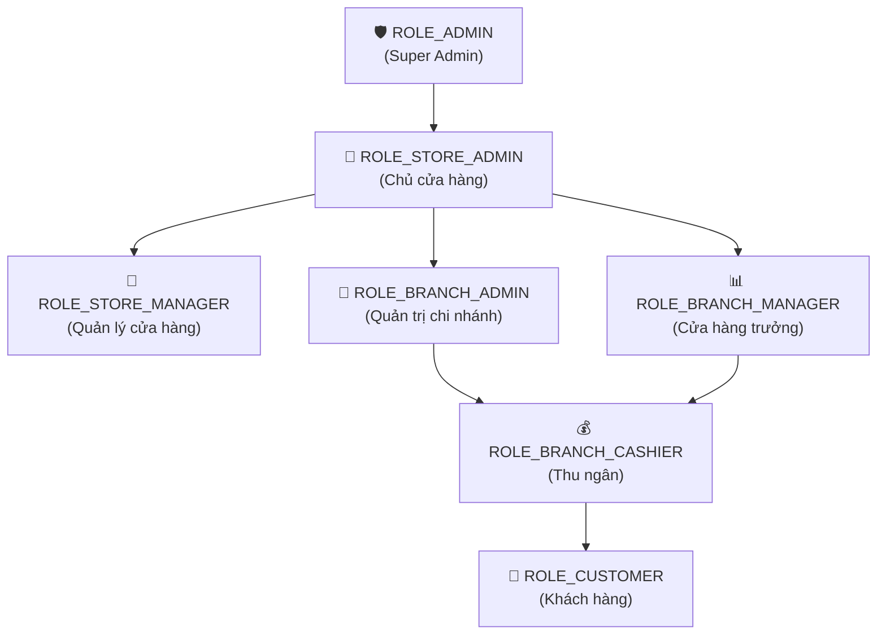
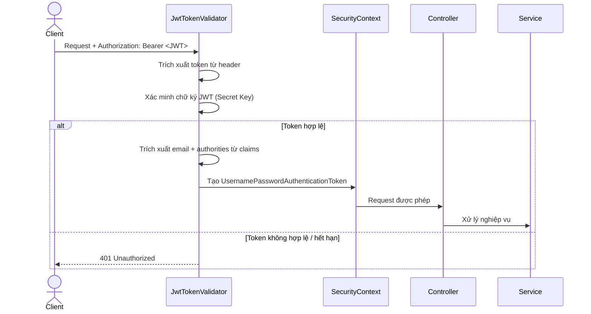
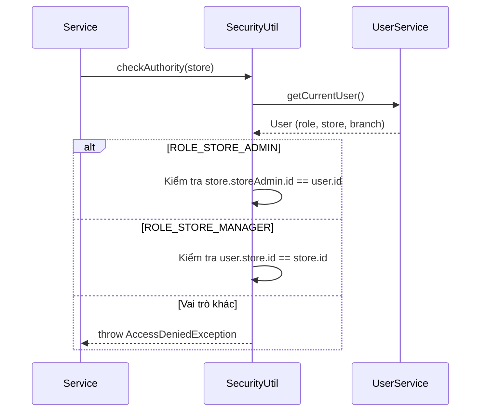

# TDD: Phân quyền (Authorization & RBAC)

## 1. Tổng quan

Module Phân quyền quản lý hệ thống kiểm soát truy cập dựa trên vai trò (RBAC) cho toàn bộ DMart POS. Hệ thống sử dụng 7 vai trò phân cấp, kết hợp Spring Security `@PreAuthorize` annotation và JWT stateless authentication.

**Các thành phần chính:**
- `JwtProvider.java` — Tạo và xác thực JWT token
- `AppConfig.java` — Cấu hình Security Filter Chain
- `SecurityUtil.java` — Kiểm tra quyền sở hữu dữ liệu (data-level authorization)
- `UserRole.java` — Enum định nghĩa 7 vai trò

---

## 2. Hệ thống Vai trò (Roles)

### 2.1 Danh sách Vai trò

| # | Role Enum | Tên hiển thị | Cấp | Mô tả |
|---|-----------|-------------|-----|-------|
| 1 | `ROLE_ADMIN` | Super Admin | Hệ thống | Quản trị viên tổng, duyệt cửa hàng, quản lý gói dịch vụ |
| 2 | `ROLE_STORE_ADMIN` | Chủ cửa hàng | Cửa hàng | Sở hữu cửa hàng, quản lý chi nhánh, thanh toán gói dịch vụ |
| 3 | `ROLE_STORE_MANAGER` | Quản lý cửa hàng | Cửa hàng | Quản lý sản phẩm, kho hàng, nhân viên cấp cửa hàng |
| 4 | `ROLE_BRANCH_ADMIN` | Quản trị chi nhánh | Chi nhánh | Quản trị nhân sự, xóa dữ liệu tại chi nhánh |
| 5 | `ROLE_BRANCH_MANAGER` | Cửa hàng trưởng | Chi nhánh | Giám sát doanh thu, ca làm việc, đơn hàng chi nhánh |
| 6 | `ROLE_BRANCH_CASHIER` | Thu ngân | Chi nhánh | Bán hàng POS, quản lý ca, xử lý hoàn tiền |
| 7 | `ROLE_CUSTOMER` | Khách hàng | — | Tích điểm thưởng |

### 2.2 Sơ đồ Phân cấp

---

## 3. Ma trận Phân quyền API

### 3.1 Authentication & User

| API | ADMIN | STORE_ADMIN | STORE_MGR | BRANCH_ADMIN | BRANCH_MGR | CASHIER | PUBLIC |
|-----|:-----:|:-----------:|:---------:|:------------:|:----------:|:-------:|:------:|
| POST /auth/signup | — | — | — | — | — | — | ✅ |
| POST /auth/login | — | — | — | — | — | — | ✅ |
| GET /api/users/profile | ✅ | ✅ | ✅ | ✅ | ✅ | ✅ | — |

### 3.2 Store Management

| API | ADMIN | STORE_ADMIN | STORE_MGR | BRANCH_ADMIN | BRANCH_MGR | CASHIER |
|-----|:-----:|:-----------:|:---------:|:------------:|:----------:|:-------:|
| POST /api/stores | — | ✅ | — | — | — | — |
| PUT /api/stores/{id} | — | ✅ | — | — | — | — |
| DELETE /api/stores | — | ✅ | — | — | — | — |
| GET /api/stores (all) | ✅ | — | — | — | — | — |
| PUT /api/stores/{id}/moderate | ✅ | — | — | — | — | — |
| POST /api/stores/add/employee | — | ✅ | ✅ | — | — | — |

### 3.3 Branch Management

| API | ADMIN | STORE_ADMIN | STORE_MGR | BRANCH_ADMIN | BRANCH_MGR | CASHIER |
|-----|:-----:|:-----------:|:---------:|:------------:|:----------:|:-------:|
| POST /api/branches | — | ✅ | — | — | — | — |
| PUT /api/branches/{id} | — | ✅ | — | — | — | — |
| DELETE /api/branches/{id} | — | ✅ | — | — | — | — |
| GET /api/branches/{id} | — | ✅ | ✅ | ✅ | ✅ | ✅ |

### 3.4 Employee Management

| API | ADMIN | STORE_ADMIN | STORE_MGR | BRANCH_ADMIN | BRANCH_MGR | CASHIER |
|-----|:-----:|:-----------:|:---------:|:------------:|:----------:|:-------:|
| POST /api/employees/store/{id} | — | ✅ | ✅ | — | — | — |
| POST /api/employees/branch/{id} | — | — | — | ✅ | ✅ | — |
| PUT /api/employees/{id} | — | ✅ | ✅ | ✅ | ✅ | — |
| DELETE /api/employees/{id} | — | ✅ | ✅ | ✅ | — | — |

### 3.5 Product & Category

| API | ADMIN | STORE_ADMIN | STORE_MGR | BRANCH_ADMIN | BRANCH_MGR | CASHIER |
|-----|:-----:|:-----------:|:---------:|:------------:|:----------:|:-------:|
| POST /api/products | — | ✅ | ✅ | — | — | — |
| PATCH /api/products/{id} | — | ✅ | ✅ | — | — | — |
| DELETE /api/products/{id} | — | ✅ | ✅ | — | — | — |
| POST /api/categories | — | ✅ | ✅ | — | — | — |

### 3.6 Inventory

| API | ADMIN | STORE_ADMIN | STORE_MGR | BRANCH_ADMIN | BRANCH_MGR | CASHIER |
|-----|:-----:|:-----------:|:---------:|:------------:|:----------:|:-------:|
| POST /api/inventories | — | ✅ | ✅ | — | — | — |
| PUT /api/inventories/{id} | — | ✅ | ✅ | — | — | — |
| DELETE /api/inventories/{id} | — | ✅ | ✅ | — | — | — |

### 3.7 Order

| API | ADMIN | STORE_ADMIN | STORE_MGR | BRANCH_ADMIN | BRANCH_MGR | CASHIER |
|-----|:-----:|:-----------:|:---------:|:------------:|:----------:|:-------:|
| POST /api/orders | — | — | — | — | — | ✅ |
| GET /api/orders/recent/{branchId} | — | — | — | ✅ | ✅ | — |
| DELETE /api/orders/{id} | — | ✅ | ✅ | — | — | — |

### 3.8 Refund

| API | ADMIN | STORE_ADMIN | STORE_MGR | BRANCH_ADMIN | BRANCH_MGR | CASHIER |
|-----|:-----:|:-----------:|:---------:|:------------:|:----------:|:-------:|
| POST /api/refunds | — | — | — | — | — | ✅ |
| GET /api/refunds (all) | — | ✅ | ✅ | — | — | — |
| GET /api/refunds/branch/{id} | — | — | — | ✅ | ✅ | — |
| DELETE /api/refunds/{id} | — | ✅ | — | ✅ | — | — |

### 3.9 Shift Report

| API | ADMIN | STORE_ADMIN | STORE_MGR | BRANCH_ADMIN | BRANCH_MGR | CASHIER |
|-----|:-----:|:-----------:|:---------:|:------------:|:----------:|:-------:|
| POST /api/shift-reports/start | — | — | — | — | — | ✅ |
| PATCH /api/shift-reports/end | — | — | — | — | — | ✅ |
| GET /api/shift-reports/branch/{id} | — | — | — | ✅ | ✅ | — |
| GET /api/shift-reports (all) | — | ✅ | ✅ | — | — | — |
| DELETE /api/shift-reports/{id} | — | ✅ | — | ✅ | — | — |

### 3.10 Payment & Subscription

| API | ADMIN | STORE_ADMIN | STORE_MGR | BRANCH_ADMIN | BRANCH_MGR | CASHIER |
|-----|:-----:|:-----------:|:---------:|:------------:|:----------:|:-------:|
| POST /api/payments/create | — | ✅ | — | — | — | — |
| GET /api/super-admin/subscription-plans | ✅ | — | — | — | — | — |
| POST /api/super-admin/subscription-plans | ✅ | — | — | — | — | — |

---

## 4. Cơ chế Bảo mật

### 4.1 JWT Token Flow

### 4.2 SecurityUtil — Kiểm tra Quyền Sở hữu Dữ liệu

---

## 5. Database Schema

### Bảng `users` — Trường liên quan đến phân quyền

| Trường | Kiểu | Mô tả |
|--------|------|-------|
| role | ENUM (UserRole) | Vai trò của người dùng |
| store_id | BIGINT (FK) | Cửa hàng thuộc về (cho Store Manager, Branch roles) |
| branch_id | BIGINT (FK) | Chi nhánh thuộc về (cho Branch roles) |

---

## 6. Nghiệp vụ Phụ thuộc

| Module | Quan hệ | Mô tả |
|--------|---------|-------|
| **Authentication** | Trực tiếp | JWT token chứa thông tin role |
| **Tất cả Controllers** | Trực tiếp | Mọi endpoint đều sử dụng `@PreAuthorize` |
| **SecurityUtil** | Trực tiếp | Kiểm tra quyền sở hữu dữ liệu tại service layer |

---

## 7. Error Handling

| HTTP Code | Lỗi | Mô tả |
|-----------|------|-------|
| 401 | Unauthorized | JWT token thiếu, hết hạn, hoặc không hợp lệ |
| 403 | Forbidden | Vai trò không đủ quyền truy cập endpoint |
| 403 | AccessDeniedException | Không phải chủ sở hữu dữ liệu (SecurityUtil) |

---

## 8. Test Cases

| # | Test Case | Expected |
|---|-----------|----------|
| TC-01 | Request không có JWT header | 401 Unauthorized |
| TC-02 | JWT token hết hạn | 401 Unauthorized |
| TC-03 | CASHIER gọi POST /api/products | 403 Forbidden |
| TC-04 | STORE_MANAGER xóa store của người khác | 403 AccessDenied |
| TC-05 | STORE_ADMIN tạo branch cho store của mình | 200 OK |
| TC-06 | BRANCH_MANAGER gọi DELETE /api/employees/{id} | 403 Forbidden |

---

## 9. Deployment Notes

| Biến | Mô tả |
|------|-------|
| `JWT_SECRET` | Secret key ≥ 256 bits cho HS256 |
| `JWT_EXPIRATION` | Token TTL (mặc định 24h) |

**Lưu ý:**
- Spring Security Filter Chain: `JwtTokenValidator` chạy trước mọi request
- `@PreAuthorize` kiểm tra role-level, `SecurityUtil` kiểm tra data-level
- Khi thêm endpoint mới, **bắt buộc** thêm `@PreAuthorize` annotation
