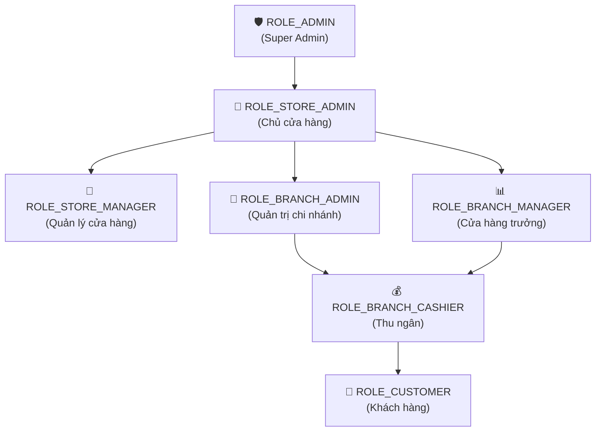
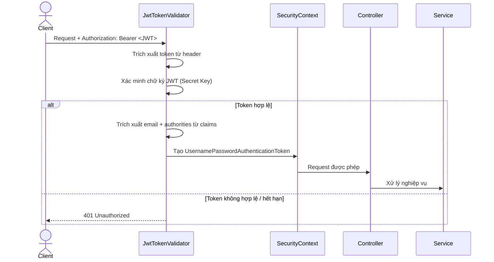
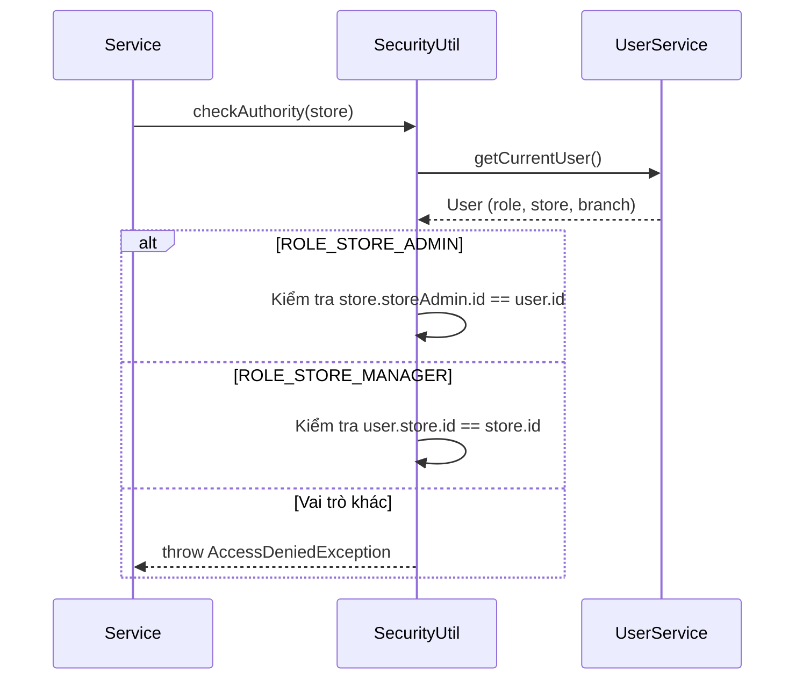

# TDD: Phân quyền (Authorization & RBAC)

## 1. Tổng quan

Module Phân quyền quản lý hệ thống kiểm soát truy cập dựa trên vai trò (RBAC) cho toàn bộ DMart POS. Hệ thống sử dụng 7 vai trò phân cấp, kết hợp Spring Security `@PreAuthorize` annotation và JWT stateless authentication.

**Các thành phần chính:**
- `JwtProvider.java` — Tạo và xác thực JWT token
- `AppConfig.java` — Cấu hình Security Filter Chain
- `SecurityUtil.java` — Kiểm tra quyền sở hữu dữ liệu (data-level authorization)
- `UserRole.java` — Enum định nghĩa 7 vai trò

---

## 2. Hệ thống Vai trò (Roles)

### 2.1 Danh sách Vai trò

| # | Role Enum | Tên hiển thị | Cấp | Mô tả |
|---|-----------|-------------|-----|-------|
| 1 | `ROLE_ADMIN` | Super Admin | Hệ thống | Quản trị viên tổng, duyệt cửa hàng, quản lý gói dịch vụ |
| 2 | `ROLE_STORE_ADMIN` | Chủ cửa hàng | Cửa hàng | Sở hữu cửa hàng, quản lý chi nhánh, thanh toán gói dịch vụ |
| 3 | `ROLE_STORE_MANAGER` | Quản lý cửa hàng | Cửa hàng | Quản lý sản phẩm, kho hàng, nhân viên cấp cửa hàng |
| 4 | `ROLE_BRANCH_ADMIN` | Quản trị chi nhánh | Chi nhánh | Quản trị nhân sự, xóa dữ liệu tại chi nhánh |
| 5 | `ROLE_BRANCH_MANAGER` | Cửa hàng trưởng | Chi nhánh | Giám sát doanh thu, ca làm việc, đơn hàng chi nhánh |
| 6 | `ROLE_BRANCH_CASHIER` | Thu ngân | Chi nhánh | Bán hàng POS, quản lý ca, xử lý hoàn tiền |
| 7 | `ROLE_CUSTOMER` | Khách hàng | — | Tích điểm thưởng |

### 2.2 Sơ đồ Phân cấp

---

## 3. Ma trận Phân quyền API (Đầy đủ 113 API)

Dưới đây là ma trận phân quyền chi tiết cho toàn bộ **113 API Endpoints** được cấu hình trong hệ thống, nhóm theo các phân hệ nghiệp vụ.

### 3.1 Xác thực & Hồ sơ (Auth & User Profiles)

| HTTP Method | Path | Method Name | ADMIN | STORE_ADMIN | STORE_MGR | BRANCH_ADMIN | BRANCH_MGR | CASHIER | CUSTOMER | PUBLIC |
| :--- | :--- | :--- | :---: | :---: | :---: | :---: | :---: | :---: | :---: | :---: |
| `POST` | `/auth/signup` | `signupHandler` | — | — | — | — | — | — | — | ✅ |
| `POST` | `/auth/login` | `loginHandler` | — | — | — | — | — | — | — | ✅ |
| `POST` | `/auth/forgot-password` | `forgotPassword` | — | — | — | — | — | — | — | ✅ |
| `POST` | `/auth/reset-password` | `resetPassword` | — | — | — | — | — | — | — | ✅ |
| `GET` | `/api/users/profile` | `getUserProfileFromJwtHandler` | ✅ | ✅ | ✅ | ✅ | ✅ | ✅ | ✅ | — |
| `GET` | `/api/users/customer` | `getCustomerList` | ✅ | ✅ | ✅ | ✅ | ✅ | ✅ | ✅ | — |
| `GET` | `/api/users/cashier` | `getCashierList` | ✅ | ✅ | ✅ | ✅ | ✅ | ✅ | ✅ | — |
| `GET` | `/users/list` | `getUsersListHandler` | ✅ | ✅ | ✅ | ✅ | ✅ | ✅ | ✅ | — |
| `GET` | `/users/{userId}` | `getUserByIdHandler` | ✅ | ✅ | ✅ | ✅ | ✅ | ✅ | ✅ | — |

### 3.2 Quản lý Cửa hàng (Store Management)

| HTTP Method | Path | Method Name | ADMIN | STORE_ADMIN | STORE_MGR | BRANCH_ADMIN | BRANCH_MGR | CASHIER | CUSTOMER | PUBLIC |
| :--- | :--- | :--- | :---: | :---: | :---: | :---: | :---: | :---: | :---: | :---: |
| `POST` | `/api/stores` | `createStore` | ✅ | ✅ | ✅ | ✅ | ✅ | ✅ | ✅ | — |
| `GET` | `/api/stores/{id}` | `getStoreById` | ✅ | ✅ | ✅ | ✅ | ✅ | ✅ | ✅ | — |
| `PUT` | `/api/stores/{id}` | `updateStore` | ✅ | ✅ | ✅ | ✅ | ✅ | ✅ | ✅ | — |
| `DELETE` | `/api/stores` | `deleteStore` | ✅ | ✅ | ✅ | ✅ | ✅ | ✅ | ✅ | — |
| `GET` | `/api/stores/admin` | `getStoresByAdminId` | ✅ | ✅ | ✅ | ✅ | ✅ | ✅ | ✅ | — |
| `GET` | `/api/stores/employee` | `getStoresByEmployee` | ✅ | ✅ | ✅ | ✅ | ✅ | ✅ | ✅ | — |
| `GET` | `/api/stores/{storeId}/employee/list` | `getStoreEmployeeList` | ✅ | ✅ | ✅ | — | — | — | — | — |
| `POST` | `/api/stores/add/employee` | `addEmployee` | ✅ | ✅ | ✅ | — | — | — | — | — |
| `GET` | `/api/stores` | `getAllStores` | ✅ | ✅ | ✅ | ✅ | ✅ | ✅ | ✅ | — |
| `PUT` | `/api/stores/{storeId}/moderate` | `moderateStore` | ✅ | ✅ | ✅ | ✅ | ✅ | ✅ | ✅ | — |

### 3.3 Quản lý Chi nhánh (Branch Management)

| HTTP Method | Path | Method Name | ADMIN | STORE_ADMIN | STORE_MGR | BRANCH_ADMIN | BRANCH_MGR | CASHIER | CUSTOMER | PUBLIC |
| :--- | :--- | :--- | :---: | :---: | :---: | :---: | :---: | :---: | :---: | :---: |
| `POST` | `/api/branches` | `createBranch` | ✅ | ✅ | — | — | — | — | — | — |
| `GET` | `/api/branches/{id}` | `getBranch` | ✅ | ✅ | ✅ | ✅ | ✅ | ✅ | ✅ | — |
| `GET` | `/api/branches/store/{storeId}` | `getAllBranches` | ✅ | ✅ | ✅ | ✅ | ✅ | ✅ | ✅ | — |
| `PUT` | `/api/branches/{id}` | `updateBranch` | ✅ | ✅ | — | — | — | — | — | — |
| `DELETE` | `/api/branches/{id}` | `deleteBranch` | ✅ | ✅ | — | — | — | — | — | — |

### 3.4 Quản lý Nhân viên (Employee Management)

| HTTP Method | Path | Method Name | ADMIN | STORE_ADMIN | STORE_MGR | BRANCH_ADMIN | BRANCH_MGR | CASHIER | CUSTOMER | PUBLIC |
| :--- | :--- | :--- | :---: | :---: | :---: | :---: | :---: | :---: | :---: | :---: |
| `POST` | `/api/employees/store/{storeId}` | `createStoreEmployee` | ✅ | ✅ | ✅ | — | — | — | — | — |
| `POST` | `/api/employees/branch/{branchId}` | `createBranchEmployee` | ✅ | — | — | ✅ | ✅ | — | — | — |
| `PUT` | `/api/employees/{employeeId}` | `updateEmployee` | ✅ | ✅ | ✅ | ✅ | ✅ | — | — | — |
| `DELETE` | `/api/employees/{employeeId}` | `deleteEmployee` | ✅ | ✅ | ✅ | ✅ | — | — | — | — |
| `GET` | `/api/employees/{employeeId}` | `findEmployeeById` | ✅ | ✅ | ✅ | ✅ | ✅ | — | — | — |
| `GET` | `/api/employees/store/{storeId}` | `findStoreEmployees` | ✅ | ✅ | ✅ | — | — | — | — | — |
| `GET` | `/api/employees/branch/{branchId}` | `findBranchEmployees` | ✅ | — | — | ✅ | ✅ | — | — | — |

### 3.5 Sản phẩm & Danh mục (Product & Category)

| HTTP Method | Path | Method Name | ADMIN | STORE_ADMIN | STORE_MGR | BRANCH_ADMIN | BRANCH_MGR | CASHIER | CUSTOMER | PUBLIC |
| :--- | :--- | :--- | :---: | :---: | :---: | :---: | :---: | :---: | :---: | :---: |
| `POST` | `/api/categories` | `createCategory` | ✅ | ✅ | ✅ | — | — | — | — | — |
| `GET` | `/api/categories/store/{storeId}` | `getCategories` | ✅ | ✅ | ✅ | ✅ | ✅ | ✅ | ✅ | — |
| `PUT` | `/api/categories/{id}` | `updateCategory` | ✅ | ✅ | ✅ | — | — | — | — | — |
| `DELETE` | `/api/categories/{id}` | `deleteCategory` | ✅ | ✅ | ✅ | — | — | — | — | — |
| `POST` | `/api/products` | `create` | ✅ | ✅ | ✅ | — | — | — | — | — |
| `GET` | `/api/products/{id}` | `getById` | ✅ | ✅ | ✅ | ✅ | ✅ | ✅ | ✅ | — |
| `PATCH` | `/api/products/{id}` | `update` | ✅ | ✅ | ✅ | — | — | — | — | — |
| `DELETE` | `/api/products/{id}` | `delete` | ✅ | ✅ | ✅ | — | — | — | — | — |
| `GET` | `/api/products/store/{storeId}` | `getByStore` | ✅ | ✅ | ✅ | ✅ | ✅ | ✅ | ✅ | — |
| `GET` | `/api/products/store/{storeId}/search` | `searchByKeyword` | ✅ | ✅ | ✅ | ✅ | ✅ | ✅ | ✅ | — |

### 3.6 Kho hàng (Inventory)

| HTTP Method | Path | Method Name | ADMIN | STORE_ADMIN | STORE_MGR | BRANCH_ADMIN | BRANCH_MGR | CASHIER | CUSTOMER | PUBLIC |
| :--- | :--- | :--- | :---: | :---: | :---: | :---: | :---: | :---: | :---: | :---: |
| `POST` | `/api/inventories` | `create` | ✅ | ✅ | ✅ | — | — | — | — | — |
| `PUT` | `/api/inventories/{id}` | `update` | ✅ | ✅ | ✅ | — | — | — | — | — |
| `DELETE` | `/api/inventories/{id}` | `delete` | ✅ | ✅ | ✅ | — | — | — | — | — |
| `GET` | `/api/inventories/{id}` | `getById` | ✅ | ✅ | ✅ | ✅ | ✅ | ✅ | ✅ | — |
| `GET` | `/api/inventories/product/{productId}` | `getInventoryByProduct` | ✅ | ✅ | ✅ | ✅ | ✅ | ✅ | ✅ | — |
| `GET` | `/api/inventories/branch/{branchId}` | `getByBranch` | ✅ | ✅ | ✅ | ✅ | ✅ | ✅ | ✅ | — |

### 3.7 Quản lý Đơn hàng (Order Management)

| HTTP Method | Path | Method Name | ADMIN | STORE_ADMIN | STORE_MGR | BRANCH_ADMIN | BRANCH_MGR | CASHIER | CUSTOMER | PUBLIC |
| :--- | :--- | :--- | :---: | :---: | :---: | :---: | :---: | :---: | :---: | :---: |
| `POST` | `/api/orders` | `createOrder` | — | — | — | — | — | ✅ | — | — |
| `GET` | `/api/orders/{id}` | `getOrder` | ✅ | ✅ | ✅ | ✅ | ✅ | ✅ | ✅ | — |
| `GET` | `/api/orders/branch/{branchId}` | `getOrdersByBranch` | ✅ | ✅ | ✅ | ✅ | ✅ | ✅ | ✅ | — |
| `GET` | `/api/orders/cashier/{cashierId}` | `getOrdersByCashier` | ✅ | ✅ | ✅ | ✅ | ✅ | ✅ | ✅ | — |
| `GET` | `/api/orders/today/branch/{branchId}` | `getTodayOrders` | ✅ | ✅ | ✅ | ✅ | ✅ | ✅ | ✅ | — |
| `GET` | `/api/orders/customer/{customerId}` | `getCustomerOrders` | ✅ | ✅ | ✅ | ✅ | ✅ | ✅ | ✅ | — |
| `GET` | `/api/orders/recent/{branchId}` | `getRecentOrders` | ✅ | — | — | ✅ | ✅ | — | — | — |
| `DELETE` | `/api/orders/{id}` | `deleteOrder` | — | — | ✅ | — | — | — | — | — |

### 3.8 Quản lý Hoàn tiền (Refund Management)

| HTTP Method | Path | Method Name | ADMIN | STORE_ADMIN | STORE_MGR | BRANCH_ADMIN | BRANCH_MGR | CASHIER | CUSTOMER | PUBLIC |
| :--- | :--- | :--- | :---: | :---: | :---: | :---: | :---: | :---: | :---: | :---: |
| `POST` | `/api/refunds` | `createRefund` | — | — | — | — | — | ✅ | — | — |
| `GET` | `/api/refunds` | `getAllRefunds` | ✅ | ✅ | ✅ | — | — | — | — | — |
| `GET` | `/api/refunds/cashier/{cashierId}` | `getRefundsByCashier` | ✅ | — | — | ✅ | ✅ | ✅ | — | — |
| `GET` | `/api/refunds/branch/{branchId}` | `getRefundsByBranch` | ✅ | — | — | ✅ | ✅ | — | — | — |
| `GET` | `/api/refunds/shift/{shiftReportId}` | `getRefundsByShift` | ✅ | — | — | ✅ | ✅ | — | — | — |
| `GET` | `/api/refunds/cashier/{cashierId}/range` | `getRefundsByCashierAndDateRange` | ✅ | — | — | ✅ | ✅ | ✅ | — | — |
| `GET` | `/api/refunds/{id}` | `getRefundById` | ✅ | ✅ | ✅ | ✅ | ✅ | ✅ | ✅ | — |
| `DELETE` | `/api/refunds/{id}` | `deleteRefund` | ✅ | ✅ | — | ✅ | — | — | — | — |

### 3.9 Báo cáo Ca (Shift Reports)

| HTTP Method | Path | Method Name | ADMIN | STORE_ADMIN | STORE_MGR | BRANCH_ADMIN | BRANCH_MGR | CASHIER | CUSTOMER | PUBLIC |
| :--- | :--- | :--- | :---: | :---: | :---: | :---: | :---: | :---: | :---: | :---: |
| `POST` | `/api/shift-reports/start` | `startShift` | — | — | — | — | — | ✅ | — | — |
| `PATCH` | `/api/shift-reports/end` | `endShift` | — | — | — | — | — | ✅ | — | — |
| `GET` | `/api/shift-reports/current` | `getCurrentShiftProgress` | — | — | — | — | — | ✅ | — | — |
| `GET` | `/api/shift-reports/cashier/{cashierId}/by-date` | `getShiftReportByDate` | ✅ | — | — | ✅ | ✅ | ✅ | — | — |
| `GET` | `/api/shift-reports/cashier/{cashierId}` | `getShiftsByCashier` | ✅ | — | — | ✅ | ✅ | ✅ | — | — |
| `GET` | `/api/shift-reports/branch/{branchId}` | `getShiftsByBranch` | ✅ | — | — | ✅ | ✅ | — | — | — |
| `GET` | `/api/shift-reports` | `getAllShifts` | ✅ | ✅ | ✅ | — | — | — | — | — |
| `GET` | `/api/shift-reports/{id}` | `getShiftById` | ✅ | ✅ | ✅ | ✅ | ✅ | ✅ | ✅ | — |
| `DELETE` | `/api/shift-reports/{id}` | `deleteShift` | ✅ | ✅ | — | ✅ | — | — | — | — |

### 3.10 Thanh toán & Gói dịch vụ (Payment & Subscription)

| HTTP Method | Path | Method Name | ADMIN | STORE_ADMIN | STORE_MGR | BRANCH_ADMIN | BRANCH_MGR | CASHIER | CUSTOMER | PUBLIC |
| :--- | :--- | :--- | :---: | :---: | :---: | :---: | :---: | :---: | :---: | :---: |
| `POST` | `/api/payments/create` | `createPaymentLink` | ✅ | ✅ | — | — | — | — | — | — |
| `PATCH` | `/api/payments/proceed` | `proceedPayment` | ✅ | ✅ | ✅ | ✅ | ✅ | ✅ | ✅ | — |
| `POST` | `/api/subscriptions/subscribe` | `createSubscription` | ✅ | ✅ | ✅ | ✅ | ✅ | ✅ | ✅ | — |
| `POST` | `/api/subscriptions/upgrade` | `upgradePlan` | ✅ | ✅ | ✅ | ✅ | ✅ | ✅ | ✅ | — |
| `PUT` | `/api/subscriptions/{subscriptionId}/activate` | `activateSubscription` | ✅ | ✅ | ✅ | ✅ | ✅ | ✅ | ✅ | — |
| `PUT` | `/api/subscriptions/{subscriptionId}/cancel` | `cancelSubscription` | ✅ | ✅ | ✅ | ✅ | ✅ | ✅ | ✅ | — |
| `PUT` | `/api/subscriptions/{subscriptionId}/payment-status` | `updatePaymentStatus` | ✅ | ✅ | ✅ | ✅ | ✅ | ✅ | ✅ | — |
| `GET` | `/api/subscriptions/store/{storeId}` | `getStoreSubscriptions` | ✅ | ✅ | ✅ | ✅ | ✅ | ✅ | ✅ | — |
| `GET` | `/api/subscriptions/admin` | `getAllSubscriptions` | ✅ | ✅ | ✅ | ✅ | ✅ | ✅ | ✅ | — |
| `GET` | `/api/subscriptions/admin/expiring` | `getExpiringSubscriptions` | ✅ | ✅ | ✅ | ✅ | ✅ | ✅ | ✅ | — |
| `GET` | `/api/subscriptions/admin/count` | `countByStatus` | ✅ | ✅ | ✅ | ✅ | ✅ | ✅ | ✅ | — |
| `POST` | `/api/super-admin/subscription-plans` | `createPlan` | ✅ | — | — | — | — | — | — | — |
| `PUT` | `/api/super-admin/subscription-plans/{id}` | `updatePlan` | ✅ | — | — | — | — | — | — | — |
| `GET` | `/api/super-admin/subscription-plans` | `getAllPlans` | ✅ | — | — | — | — | — | — | — |
| `GET` | `/api/super-admin/subscription-plans/{id}` | `getPlanById` | ✅ | — | — | — | — | — | — | — |
| `DELETE` | `/api/super-admin/subscription-plans/{id}` | `deletePlan` | ✅ | — | — | — | — | — | — | — |

### 3.11 Thống kê & Báo cáo (Analytics & Reports)

| HTTP Method | Path | Method Name | ADMIN | STORE_ADMIN | STORE_MGR | BRANCH_ADMIN | BRANCH_MGR | CASHIER | CUSTOMER | PUBLIC |
| :--- | :--- | :--- | :---: | :---: | :---: | :---: | :---: | :---: | :---: | :---: |
| `GET` | `/api/super-admin/dashboard/summary` | `getDashboardSummary` | ✅ | — | — | — | — | — | — | — |
| `GET` | `/api/super-admin/dashboard/store-registrations` | `getLast7DayRegistrationStats` | ✅ | — | — | — | — | — | — | — |
| `GET` | `/api/super-admin/dashboard/store-status-distribution` | `getStoreStatusDistribution` | ✅ | — | — | — | — | — | — | — |
| `GET` | `/api/branch-analytics/daily-sales` | `getDailySalesChart` | — | ✅ | ✅ | ✅ | ✅ | ✅ | — | — |
| `GET` | `/api/branch-analytics/top-products` | `getTopProductsByQuantity` | — | ✅ | ✅ | ✅ | ✅ | ✅ | — | — |
| `GET` | `/api/branch-analytics/top-cashiers` | `getTopCashiersByRevenue` | — | ✅ | ✅ | ✅ | ✅ | ✅ | — | — |
| `GET` | `/api/branch-analytics/category-sales` | `getCategoryWiseSalesBreakdown` | — | ✅ | ✅ | ✅ | ✅ | ✅ | — | — |
| `GET` | `/api/branch-analytics/today-overview` | `getTodayOverview` | ✅ | — | — | ✅ | ✅ | — | — | — |
| `GET` | `/api/branch-analytics/payment-breakdown` | `getPaymentBreakdown` | ✅ | — | — | ✅ | ✅ | — | — | — |
| `GET` | `/api/store/analytics/{storeAdminId}/overview` | `getStoreOverview` | ✅ | ✅ | ✅ | ✅ | ✅ | ✅ | ✅ | — |
| `GET` | `/api/store/analytics/{storeAdminId}/sales-trends` | `getSalesTrends` | ✅ | ✅ | ✅ | ✅ | ✅ | ✅ | ✅ | — |
| `GET` | `/api/store/analytics/{storeAdminId}/sales/monthly` | `getMonthlySales` | ✅ | ✅ | ✅ | ✅ | ✅ | ✅ | ✅ | — |
| `GET` | `/api/store/analytics/{storeAdminId}/sales/daily` | `getDailySales` | ✅ | ✅ | ✅ | ✅ | ✅ | ✅ | ✅ | — |
| `GET` | `/api/store/analytics/{storeAdminId}/sales/category` | `getSalesByCategory` | ✅ | ✅ | ✅ | ✅ | ✅ | ✅ | ✅ | — |
| `GET` | `/api/store/analytics/{storeAdminId}/sales/payment-method` | `getSalesByPaymentMethod` | ✅ | ✅ | ✅ | ✅ | ✅ | ✅ | ✅ | — |
| `GET` | `/api/store/analytics/{storeAdminId}/sales/branch` | `getSalesByBranch` | ✅ | ✅ | ✅ | ✅ | ✅ | ✅ | ✅ | — |
| `GET` | `/api/store/analytics/{storeAdminId}/payments` | `getPaymentBreakdown` | ✅ | ✅ | ✅ | ✅ | ✅ | ✅ | ✅ | — |
| `GET` | `/api/store/analytics/{storeAdminId}/branch-performance` | `getBranchPerformance` | ✅ | ✅ | ✅ | ✅ | ✅ | ✅ | ✅ | — |
| `GET` | `/api/store/analytics/{storeAdminId}/alerts` | `getStoreAlerts` | ✅ | ✅ | ✅ | ✅ | ✅ | ✅ | ✅ | — |

### 3.12 Quản lý Khách hàng (Customer Management)

| HTTP Method | Path | Method Name | ADMIN | STORE_ADMIN | STORE_MGR | BRANCH_ADMIN | BRANCH_MGR | CASHIER | CUSTOMER | PUBLIC |
| :--- | :--- | :--- | :---: | :---: | :---: | :---: | :---: | :---: | :---: | :---: |
| `POST` | `/api/customers` | `create` | ✅ | ✅ | ✅ | ✅ | ✅ | ✅ | ✅ | — |
| `PUT` | `/api/customers/{id}` | `update` | ✅ | ✅ | ✅ | ✅ | ✅ | ✅ | ✅ | — |
| `DELETE` | `/api/customers/{id}` | `delete` | ✅ | ✅ | ✅ | ✅ | ✅ | ✅ | ✅ | — |
| `GET` | `/api/customers/{id}` | `getById` | ✅ | ✅ | ✅ | ✅ | ✅ | ✅ | ✅ | — |
| `GET` | `/api/customers` | `getAll` | ✅ | ✅ | ✅ | ✅ | ✅ | ✅ | ✅ | — |

### 3.13 Trạng thái Hệ thống (System Status)

| HTTP Method | Path | Method Name | ADMIN | STORE_ADMIN | STORE_MGR | BRANCH_ADMIN | BRANCH_MGR | CASHIER | CUSTOMER | PUBLIC |
| :--- | :--- | :--- | :---: | :---: | :---: | :---: | :---: | :---: | :---: | :---: |
| `GET` | `/` | `HomeControllerHandler` | — | — | — | — | — | — | — | ✅ |

---

## 4. Cơ chế Bảo mật

### 4.1 JWT Token Flow

### 4.2 SecurityUtil — Kiểm tra Quyền Sở hữu Dữ liệu

---

## 5. Database Schema

### Bảng `users` — Trường liên quan đến phân quyền

| Trường | Kiểu | Mô tả |
|--------|------|-------|
| role | ENUM (UserRole) | Vai trò của người dùng |
| store_id | BIGINT (FK) | Cửa hàng thuộc về (cho Store Manager, Branch roles) |
| branch_id | BIGINT (FK) | Chi nhánh thuộc về (cho Branch roles) |

---

## 6. Nghiệp vụ Phụ thuộc

| Module | Quan hệ | Mô tả |
|--------|---------|-------|
| **Authentication** | Trực tiếp | JWT token chứa thông tin role |
| **Tất cả Controllers** | Trực tiếp | Mọi endpoint đều sử dụng `@PreAuthorize` |
| **SecurityUtil** | Trực tiếp | Kiểm tra quyền sở hữu dữ liệu tại service layer |

---

## 7. Error Handling

| HTTP Code | Lỗi | Mô tả |
|-----------|------|-------|
| 401 | Unauthorized | JWT token thiếu, hết hạn, hoặc không hợp lệ |
| 403 | Forbidden | Vai trò không đủ quyền truy cập endpoint |
| 403 | AccessDeniedException | Không phải chủ sở hữu dữ liệu (SecurityUtil) |

---

## 8. Test Cases

| # | Test Case | Expected |
|---|-----------|----------|
| TC-01 | Request không có JWT header | 401 Unauthorized |
| TC-02 | JWT token hết hạn | 401 Unauthorized |
| TC-03 | CASHIER gọi POST /api/products | 403 Forbidden |
| TC-04 | STORE_MANAGER xóa store của người khác | 403 AccessDenied |
| TC-05 | STORE_ADMIN tạo branch cho store của mình | 200 OK |
| TC-06 | BRANCH_MANAGER gọi DELETE /api/employees/{id} | 403 Forbidden |

---

## 9. Deployment Notes

| Biến | Mô tả |
|------|-------|
| `JWT_SECRET` | Secret key ≥ 256 bits cho HS256 |
| `JWT_EXPIRATION` | Token TTL (mặc định 24h) |

**Lưu ý:**
- Spring Security Filter Chain: `JwtTokenValidator` chạy trước mọi request
- `@PreAuthorize` kiểm tra role-level, `SecurityUtil` kiểm tra data-level
- Khi thêm endpoint mới, **bắt buộc** thêm `@PreAuthorize` annotation
