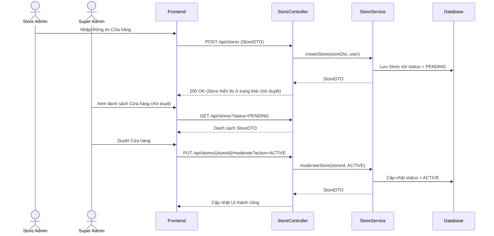

# TDD: Quản lý Cửa hàng (Store Management)

## 1. Tổng quan

Module Quản lý Cửa hàng chịu trách nhiệm quản lý thông tin các cửa hàng (Store) trong hệ thống SaaS POS. Mỗi cửa hàng đóng vai trò là một tenant riêng biệt.

**Controller:** `StoreController.java`  
**Base URL:** `/api/stores`

---

## 2. API Endpoints

| # | Method | URL | Mô tả | Phân quyền |
|---|--------|-----|-------|------------|
| 1 | POST | `/api/stores` | Tạo cửa hàng mới (Onboarding) | Public (Có JWT của Store Admin) |
| 2 | GET | `/api/stores/{id}` | Lấy chi tiết thông tin cửa hàng | Public (Xác thực JWT) |
| 3 | PUT | `/api/stores/{id}` | Cập nhật thông tin cửa hàng | `ROLE_STORE_ADMIN` |
| 4 | DELETE | `/api/stores` | Xóa cửa hàng của người dùng hiện tại | `ROLE_STORE_ADMIN` |
| 5 | GET | `/api/stores/admin` | Lấy cửa hàng của Store Admin hiện tại | `ROLE_STORE_ADMIN` |
| 6 | GET | `/api/stores/employee` | Lấy cửa hàng của Nhân viên hiện tại | `ROLE_STORE_MANAGER`, `ROLE_BRANCH_ADMIN`, `ROLE_BRANCH_MANAGER`, `ROLE_BRANCH_CASHIER` |
| 7 | GET | `/api/stores/{storeId}/employee/list` | Lấy danh sách nhân viên của cửa hàng | `ROLE_STORE_ADMIN`, `ROLE_STORE_MANAGER` |
| 8 | POST | `/api/stores/add/employee` | Thêm nhân viên vào cửa hàng | `ROLE_STORE_ADMIN`, `ROLE_STORE_MANAGER` |
| 9 | GET | `/api/stores` | Lấy tất cả cửa hàng trong hệ thống (lọc theo status) | `ROLE_ADMIN` (Super Admin) |
| 10 | PUT | `/api/stores/{storeId}/moderate` | Duyệt hoặc từ chối yêu cầu tạo cửa hàng | `ROLE_ADMIN` (Super Admin) |

---

## 3. Request / Response Schema

### 3.1 Tạo cửa hàng (POST `/api/stores`)

**Request Body (`StoreDTO`):**
```json
{
  "brand": "D Mart Hà Nội",
  "description": "Siêu thị D Mart khu vực Hà Nội",
  "storeType": "Supermarket",
  "contact": {
    "email": "contact@dmart.com",
    "phone": "0987654321",
    "address": "Số 1 Cầu Giấy, Hà Nội"
  }
}
```

**Response (`StoreDTO`):**
```json
{
  "id": 1,
  "brand": "D Mart Hà Nội",
  "description": "Siêu thị D Mart khu vực Hà Nội",
  "storeType": "Supermarket",
  "status": "PENDING",
  "contact": {
    "email": "contact@dmart.com",
    "phone": "0987654321",
    "address": "Số 1 Cầu Giấy, Hà Nội"
  },
  "createdAt": "2026-06-29T22:00:00",
  "updatedAt": "2026-06-29T22:00:00"
}
```

---

## 4. Database Schema

### 4.1 Bảng `stores`

| Trường | Kiểu | Ràng buộc | Mô tả |
|--------|------|-----------|-------|
| id | BIGINT | PK | ID tự sinh |
| brand | VARCHAR(255) | NOT NULL | Tên thương hiệu |
| description | VARCHAR(255) | — | Mô tả cửa hàng |
| store_type | VARCHAR(255) | — | Loại hình kinh doanh |
| status | VARCHAR(50) | NOT NULL | Trạng thái (PENDING, ACTIVE, BLOCKED, DECLINED) |
| store_admin_id | BIGINT | FK → users.id | ID của chủ sở hữu |
| email | VARCHAR(255) | — | Email liên hệ (StoreContact) |
| phone | VARCHAR(255) | — | Số điện thoại liên hệ (StoreContact) |
| address | VARCHAR(255) | — | Địa chỉ liên hệ (StoreContact) |
| created_at | DATETIME | — | Thời gian tạo |
| updated_at | DATETIME | — | Thời gian cập nhật |

---

## 5. Sequence Diagram

### Luồng Onboarding Cửa hàng và Duyệt



---

## 6. Nghiệp vụ Phụ thuộc
- **User Module:** Một cửa hàng phải liên kết với một `User` có vai trò `ROLE_STORE_ADMIN`.
- **Subscription Module:** Cửa hàng sau khi được duyệt cần có Subscription hoạt động (ACTIVE hoặc TRIAL) để vận hành các tính năng POS/Kho.

---

## 7. Error Handling
- `ResourceNotFoundException`: Cửa hàng không tồn tại.
- `UserException`: User không có quyền hoặc dữ liệu không hợp lệ.
- `AccessDeniedException`: Lỗi truy cập trái phép đối với các cửa hàng không thuộc sở hữu.

---

## 8. Test Cases
- **TC-01 (Happy Path):** Tạo cửa hàng thành công với thông tin hợp lệ -> Trạng thái Store là `PENDING`.
- **TC-02 (Happy Path):** Super Admin moderate duyệt store -> Trạng thái chuyển sang `ACTIVE`.
- **TC-03 (Security Path):** User không có role `ROLE_STORE_ADMIN` gửi request tạo store -> Lỗi `403 Forbidden`.
- **TC-04 (Error Path):** Đăng ký Store thiếu tên thương hiệu (`brand`) -> Lỗi `400 Bad Request`.
