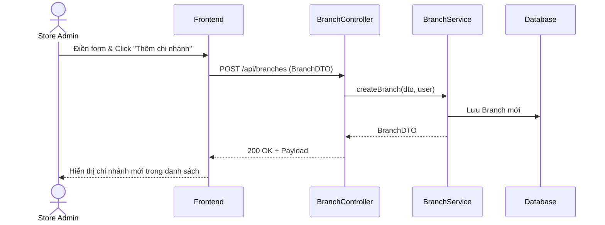

# TDD: Quản lý Chi nhánh (Branch Management)

## 1. Tổng quan

Module Quản lý Chi nhánh cho phép Store Admin chia nhỏ mô hình kinh doanh của Cửa hàng thành nhiều điểm bán hàng (Chi nhánh) vật lý khác nhau.

**Controller:** `BranchController.java`  
**Base URL:** `/api/branches`

---

## 2. API Endpoints

| # | Method | URL | Mô tả | Phân quyền |
|---|--------|-----|-------|------------|
| 1 | POST | `/api/branches` | Tạo chi nhánh mới | `ROLE_STORE_ADMIN` |
| 2 | GET | `/api/branches/{id}` | Lấy thông tin chi tiết chi nhánh | Public (Có JWT) |
| 3 | GET | `/api/branches/store/{storeId}` | Lấy danh sách chi nhánh của cửa hàng | Public (Có JWT) |
| 4 | PUT | `/api/branches/{id}` | Cập nhật thông tin chi nhánh | `ROLE_STORE_ADMIN` |
| 5 | DELETE | `/api/branches/{id}` | Xóa chi nhánh | `ROLE_STORE_ADMIN` |

---

## 3. Request / Response Schema

### 3.1 Tạo Chi nhánh (POST `/api/branches`)

**Request Body (`BranchDTO`):**
```json
{
  "name": "Chi nhánh Cầu Giấy",
  "address": "12 Cầu Giấy, Hà Nội",
  "phone": "0912345678",
  "email": "caugiay@dmart.com",
  "workingDays": ["MONDAY", "TUESDAY", "WEDNESDAY", "THURSDAY", "FRIDAY", "SATURDAY", "SUNDAY"],
  "openTime": "08:00:00",
  "closeTime": "22:00:00"
}
```

**Response (`BranchDTO`):**
```json
{
  "id": 10,
  "name": "Chi nhánh Cầu Giấy",
  "address": "12 Cầu Giấy, Hà Nội",
  "phone": "0912345678",
  "email": "caugiay@dmart.com",
  "workingDays": ["MONDAY", "TUESDAY", "WEDNESDAY", "THURSDAY", "FRIDAY", "SATURDAY", "SUNDAY"],
  "openTime": "08:00:00",
  "closeTime": "22:00:00",
  "storeId": 1,
  "createdAt": "2026-06-29T22:05:00",
  "updatedAt": "2026-06-29T22:05:00"
}
```

---

## 4. Database Schema

### 4.1 Bảng `branches`

| Trường | Kiểu | Ràng buộc | Mô tả |
|--------|------|-----------|-------|
| id | BIGINT | PK | ID tự tăng hoặc sinh tự động |
| name | VARCHAR(255) | — | Tên chi nhánh |
| address | VARCHAR(255) | — | Địa chỉ |
| phone | VARCHAR(255) | — | Số điện thoại |
| email | VARCHAR(255) | — | Email liên hệ chi nhánh |
| open_time | TIME | — | Giờ mở cửa |
| close_time | TIME | — | Giờ đóng cửa |
| store_id | BIGINT | FK → stores.id | Thuộc cửa hàng nào |
| manager_id | BIGINT | FK → users.id | Quản lý chi nhánh (OneToOne) |
| created_at | DATETIME | — | Ngày tạo |
| updated_at | DATETIME | — | Ngày cập nhật |

---

## 5. Sequence Diagram

### Luồng Quản lý Chi nhánh bởi Store Admin



---

## 6. Nghiệp vụ Phụ thuộc
- **Store Module:** Chi nhánh luôn phải trực thuộc một `Store` cụ thể.
- **Subscription Limits:** Số lượng chi nhánh được tạo bị giới hạn bởi thuộc tính `maxBranches` trong gói đăng ký dịch vụ của Store đó.

---

## 7. Error Handling
- `EntityNotFoundException`: Không tìm thấy chi nhánh với ID yêu cầu.
- `AccessDeniedException`: Quyền bị từ chối nếu Store Admin cố gắng sửa đổi chi nhánh của Store khác.

---

## 8. Test Cases
- **TC-01 (Happy Path):** Tạo chi nhánh thành công dưới Store hợp lệ.
- **TC-02 (Limit Exceeded):** Tạo chi nhánh vượt quá giới hạn gói dịch vụ (ví dụ: gói Starter tối đa 1 chi nhánh) -> Trả về lỗi nghiệp vụ.
- **TC-03 (Security Path):** Tài khoản `Store Manager` cố gắng truy cập API DELETE chi nhánh -> Trả về lỗi `403 Forbidden` do phân quyền giao diện Frontend lẫn bảo mật API Backend.
