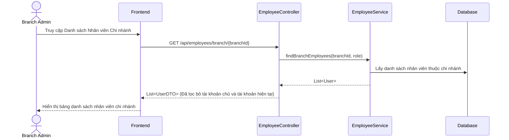

# TDD: Quản lý Nhân viên (Employee Management)

## 1. Tổng quan

Module Quản lý Nhân viên chịu trách nhiệm phân quyền tài khoản cho nhân viên cấp cửa hàng (Store Manager) và các nhân viên cấp chi nhánh (Branch Manager, Branch Admin, Cashier).

**Controller:** `EmployeeController.java`  
**Base URL:** `/api/employees`

---

## 2. API Endpoints

| # | Method | URL | Mô tả | Phân quyền |
|---|--------|-----|-------|------------|
| 1 | POST | `/api/employees/store/{storeId}` | Tạo nhân viên cấp Store (Store Manager) | `ROLE_STORE_ADMIN`, `ROLE_STORE_MANAGER` |
| 2 | POST | `/api/employees/branch/{branchId}` | Tạo nhân viên cấp Chi nhánh (Branch Manager, Cashier, v.v.) | `ROLE_BRANCH_ADMIN`, `ROLE_BRANCH_MANAGER` |
| 3 | PUT | `/api/employees/{employeeId}` | Cập nhật thông tin nhân viên | `ROLE_STORE_ADMIN`, `ROLE_STORE_MANAGER`, `ROLE_BRANCH_ADMIN`, `ROLE_BRANCH_MANAGER` |
| 4 | DELETE | `/api/employees/{employeeId}` | Xóa nhân viên | `ROLE_STORE_ADMIN`, `ROLE_STORE_MANAGER`, `ROLE_BRANCH_ADMIN` |
| 5 | GET | `/api/employees/{employeeId}` | Tìm kiếm nhân viên theo ID | `ROLE_STORE_ADMIN`, `ROLE_STORE_MANAGER`, `ROLE_BRANCH_ADMIN`, `ROLE_BRANCH_MANAGER` |
| 6 | GET | `/api/employees/store/{storeId}` | Lấy danh sách nhân viên của cửa hàng | `ROLE_STORE_ADMIN`, `ROLE_STORE_MANAGER` |
| 7 | GET | `/api/employees/branch/{branchId}` | Lấy danh sách nhân viên của chi nhánh | `ROLE_BRANCH_ADMIN`, `ROLE_BRANCH_MANAGER` |
| 8 | GET | `/api/users/cashier` | Lấy danh sách tài khoản thu ngân | `ROLE_STORE_ADMIN`, `ROLE_STORE_MANAGER`, `ROLE_BRANCH_ADMIN`, `ROLE_BRANCH_MANAGER` |
| 9 | GET | `/users/list` | Lấy toàn bộ danh sách users trong hệ thống | `ROLE_ADMIN` (Super Admin) |
| 10| GET | `/users/{userId}` | Lấy thông tin chi tiết một user bất kỳ | `ROLE_ADMIN` (Super Admin) |

---

## 3. Request / Response Schema

### 3.1 Tạo nhân viên Chi nhánh (POST `/api/employees/branch/{branchId}`)

**Request Body (`User`):**
```json
{
  "fullName": "Trần Thị B",
  "email": "cashier1@dmart.com",
  "password": "Password123",
  "phone": "0988888888",
  "role": "ROLE_BRANCH_CASHIER"
}
```

**Response (`UserDTO`):**
```json
{
  "id": 15,
  "fullName": "Trần Thị B",
  "email": "cashier1@dmart.com",
  "phone": "0988888888",
  "role": "ROLE_BRANCH_CASHIER",
  "branchId": 1,
  "createdAt": "2026-06-29T22:10:00"
}
```

---

## 4. Database Schema

Dữ liệu nhân viên được lưu trực tiếp trong bảng `users` dùng chung của hệ thống với các liên kết `store_id` và `branch_id`.

---

## 5. Sequence Diagram

### Luồng Quản lý và Lọc Nhân viên Chi nhánh



---

## 6. Nghiệp vụ Phụ thuộc
- **Store & Branch Modules:** Mỗi tài khoản nhân viên được liên kết chặt chẽ với một Store và một Branch (ngoại trừ các tài khoản cấp store không có chi nhánh cụ thể).
- **Subscription Limits:** Tổng số lượng tài khoản nhân viên được tạo bị giới hạn bởi `maxUsers` của gói dịch vụ.

---

## 7. Error Handling
- `UserException`: Vai trò nhân viên không hợp lệ hoặc trùng lặp email đăng ký.
- `AccessDeniedException`: Lỗi phân quyền khi nhân viên cấp thấp cố gắng xóa nhân viên cấp cao.

---

## 8. Test Cases
- **TC-01 (Happy Path):** Tạo tài khoản Cashier thành công tại chi nhánh của mình.
- **TC-02 (Security Path):** Cửa hàng trưởng (Branch Manager) cố gắng gọi API xóa nhân viên -> Lỗi `403 Forbidden` (Chỉ Branch Admin có quyền xóa nhân sự chi nhánh).
- **TC-03 (Logic Path):** Không thể tạo hai nhân viên có cùng email đăng ký -> Trả về lỗi trùng lặp.
