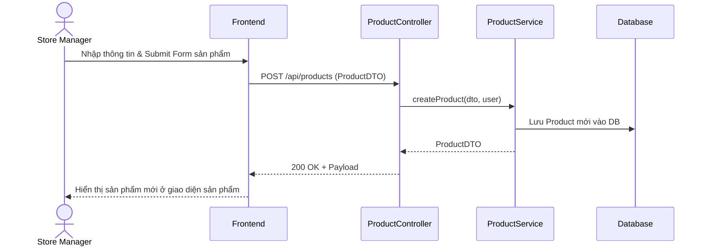

# TDD: Sản phẩm & Danh mục (Product & Category)

## 1. Tổng quan

Module Sản phẩm & Danh mục quản lý thông tin các mặt hàng, giá bán lẻ tối đa (MRP), giá bán thực tế và cách phân nhóm các mặt hàng theo danh mục trong toàn chuỗi cửa hàng.

**Controllers:** `ProductController.java`, `CategoryController.java`  
**Base URLs:** `/api/products`, `/api/categories`

---

## 2. API Endpoints

### 2.1 Sản phẩm (`/api/products`)

| # | Method | URL | Mô tả | Phân quyền |
|---|--------|-----|-------|------------|
| 1 | POST | `/api/products` | Tạo sản phẩm mới | `ROLE_STORE_ADMIN`, `ROLE_STORE_MANAGER` |
| 2 | GET | `/api/products/{id}` | Lấy thông tin sản phẩm theo ID | Public (Có JWT) |
| 3 | PATCH | `/api/products/{id}` | Cập nhật thông tin sản phẩm | `ROLE_STORE_ADMIN`, `ROLE_STORE_MANAGER` |
| 4 | DELETE | `/api/products/{id}` | Xóa sản phẩm khỏi hệ thống | `ROLE_STORE_ADMIN`, `ROLE_STORE_MANAGER` |
| 5 | GET | `/api/products/store/{storeId}` | Lấy danh sách sản phẩm của cửa hàng | Public (Có JWT) |
| 6 | GET | `/api/products/store/{storeId}/search` | Tìm kiếm sản phẩm theo tên/SKU | Public (Có JWT) |

### 2.2 Danh mục (`/api/categories`)

| # | Method | URL | Mô tả | Phân quyền |
|---|--------|-----|-------|------------|
| 1 | POST | `/api/categories` | Tạo danh mục mới | `ROLE_STORE_ADMIN`, `ROLE_STORE_MANAGER` |
| 2 | GET | `/api/categories/store/{storeId}` | Lấy tất cả danh mục của cửa hàng | Public (Có JWT) |
| 3 | PUT | `/api/categories/{id}` | Cập nhật danh mục | `ROLE_STORE_ADMIN`, `ROLE_STORE_MANAGER` |
| 4 | DELETE | `/api/categories/{id}` | Xóa danh mục | `ROLE_STORE_ADMIN`, `ROLE_STORE_MANAGER` |

---

## 3. Request / Response Schema

### 3.1 Tạo Sản phẩm (POST `/api/products`)

**Request Body (`ProductDTO`):**
```json
{
  "name": "Nước khoáng Lavie 500ml",
  "sku": "LAVIE500ML01",
  "description": "Nước khoáng thiên nhiên tinh khiết",
  "mrp": 6000.0,
  "sellingPrice": 5000.0,
  "brand": "Lavie",
  "image": "https://image-url-placeholder.com/lavie.png",
  "categoryId": 2,
  "storeId": 1
}
```

**Response (`ProductDTO`):**
```json
{
  "id": 101,
  "name": "Nước khoáng Lavie 500ml",
  "sku": "LAVIE500ML01",
  "description": "Nước khoáng thiên nhiên tinh khiết",
  "mrp": 6000.0,
  "sellingPrice": 5000.0,
  "brand": "Lavie",
  "image": "https://image-url-placeholder.com/lavie.png",
  "categoryId": 2,
  "storeId": 1,
  "createdAt": "2026-06-29T22:15:00",
  "updatedAt": "2026-06-29T22:15:00"
}
```

---

## 4. Database Schema

### 4.1 Bảng `products`

| Trường | Kiểu | Ràng buộc | Mô tả |
|--------|------|-----------|-------|
| id | BIGINT | PK | ID tự tăng |
| name | VARCHAR(255) | NOT NULL | Tên sản phẩm |
| sku | VARCHAR(255) | NOT NULL, UNIQUE | Mã vạch/Mã SKU |
| description | VARCHAR(255) | — | Mô tả sản phẩm |
| mrp | DOUBLE | NOT NULL | Giá bán lẻ tối đa |
| selling_price | DOUBLE | NOT NULL | Giá bán thực tế |
| brand | VARCHAR(255) | — | Thương hiệu |
| image | TEXT | — | URL ảnh sản phẩm |
| category_id | BIGINT | FK → categories.id | Thuộc danh mục nào |
| store_id | BIGINT | FK → stores.id | Thuộc cửa hàng nào |
| created_at | DATETIME | — | Ngày tạo |
| updated_at | DATETIME | — | Ngày cập nhật |

### 4.2 Bảng `categories`

| Trường | Kiểu | Ràng buộc | Mô tả |
|--------|------|-----------|-------|
| id | BIGINT | PK | ID tự tăng |
| name | VARCHAR(255) | NOT NULL | Tên danh mục |
| store_id | BIGINT | FK → stores.id | Thuộc cửa hàng nào |

---

## 5. Sequence Diagram

### Luồng Quản lý sản phẩm của Store Manager



---

## 6. Nghiệp vụ Phụ thuộc
- **Store Module:** Mọi sản phẩm và danh mục chỉ có giá trị trong phạm vi Tenant/Store của mình.
- **Subscription Plan:** Số lượng sản phẩm tối đa được tạo bị giới hạn bởi `maxProducts` của gói dịch vụ đã đăng ký.

---

## 7. Error Handling
- Trùng mã SKU (`DataIntegrityViolationException`): Trả về lỗi SKU đã được sử dụng.
- `AccessDeniedException`: Lọc người dùng sửa đổi sản phẩm ngoài Store của họ.

---

## 8. Test Cases
- **TC-01 (Happy Path):** Tạo sản phẩm thành công và tự động gán Store ID của người quản lý.
- **TC-02 (Error Path):** Đăng ký sản phẩm có SKU trùng lặp -> Báo lỗi SKU đã tồn tại.
- **TC-03 (Security Path):** Nhân viên thu ngân (Cashier) cố gửi API PATCH sản phẩm -> Báo lỗi `403 Forbidden`.
