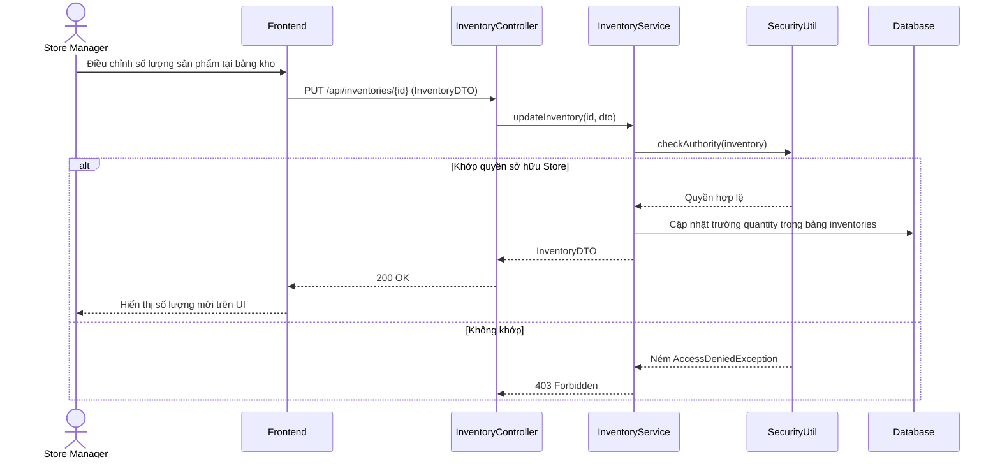

# TDD: Kho hàng (Inventory)

## 1. Tổng quan

Module Kho hàng quản lý số lượng tồn kho của từng sản phẩm tại từng chi nhánh cụ thể. Cho phép cập nhật tồn kho sau khi nhập hàng hoặc tự động trừ kho khi phát sinh đơn hàng thành công.

**Controller:** `InventoryController.java`  
**Base URL:** `/api/inventories`

---

## 2. API Endpoints

| # | Method | URL | Mô tả | Phân quyền |
|---|--------|-----|-------|------------|
| 1 | POST | `/api/inventories` | Tạo bản ghi kho hàng mới cho một sản phẩm tại chi nhánh | `ROLE_STORE_ADMIN`, `ROLE_STORE_MANAGER` |
| 2 | PUT | `/api/inventories/{id}` | Cập nhật số lượng sản phẩm trong kho | `ROLE_STORE_ADMIN`, `ROLE_STORE_MANAGER` |
| 3 | DELETE | `/api/inventories/{id}` | Xóa bản ghi kho hàng | `ROLE_STORE_ADMIN`, `ROLE_STORE_MANAGER` |
| 4 | GET | `/api/inventories/{id}` | Lấy chi tiết bản ghi kho theo ID | Public (Có JWT) |
| 5 | GET | `/api/inventories/product/{productId}` | Lấy thông tin kho của sản phẩm | Public (Có JWT) |
| 6 | GET | `/api/inventories/branch/{branchId}` | Lấy toàn bộ tồn kho tại một chi nhánh | Public (Có JWT) |

---

## 3. Request / Response Schema

### 3.1 Cập nhật số lượng tồn kho (PUT `/api/inventories/{id}`)

**Request Body (`InventoryDTO`):**
```json
{
  "quantity": 150
}
```

**Response (`InventoryDTO`):**
```json
{
  "id": 5,
  "branchId": 1,
  "productId": 101,
  "quantity": 150,
  "lastUpdated": "2026-06-29T22:20:00"
}
```

---

## 4. Database Schema

### 4.1 Bảng `inventories`

| Trường | Kiểu | Ràng buộc | Mô tả |
|--------|------|-----------|-------|
| id | BIGINT | PK | ID tự tăng |
| branch_id | BIGINT | FK → branches.id, NOT NULL | Địa điểm lưu trữ |
| product_id | BIGINT | FK → products.id, NOT NULL | Sản phẩm trong kho |
| quantity | INT | NOT NULL | Số lượng tồn kho hiện tại |
| last_updated | DATETIME | — | Thời gian cập nhật cuối |

---

## 5. Sequence Diagram

### Luồng Cập nhật tồn kho thủ công bởi Store Manager



---

## 6. Nghiệp vụ Phụ thuộc
- **Product & Branch Modules:** Inventory liên kết trực tiếp giữa thực thể `Product` và `Branch`.
- **Order Module:** Khi thu ngân chốt đơn thành công tại POS, hệ thống sẽ thực hiện giảm trừ số lượng (`quantity`) tương ứng của sản phẩm tại chi nhánh đó.

---

## 7. Error Handling
- `EntityNotFoundException`: Không tìm thấy bản ghi kho hoặc chi nhánh/sản phẩm không tồn tại.
- `AccessDeniedException`: Lỗi xảy ra khi Store Admin/Manager cố truy cập hay sửa đổi tồn kho của Store khác.

---

## 8. Test Cases
- **TC-01 (Happy Path):** Cập nhật tồn kho thành công cho chi nhánh thuộc quyền quản lý.
- **TC-02 (Security Path):** Quản lý chi nhánh khác cố gọi API chỉnh sửa kho -> Hệ thống ném lỗi `AccessDeniedException`.
- **TC-03 (Logic Path):** Trừ kho tự động khi bán hàng: Bán 5 chai Lavie -> Số lượng kho giảm đi đúng 5 đơn vị.
