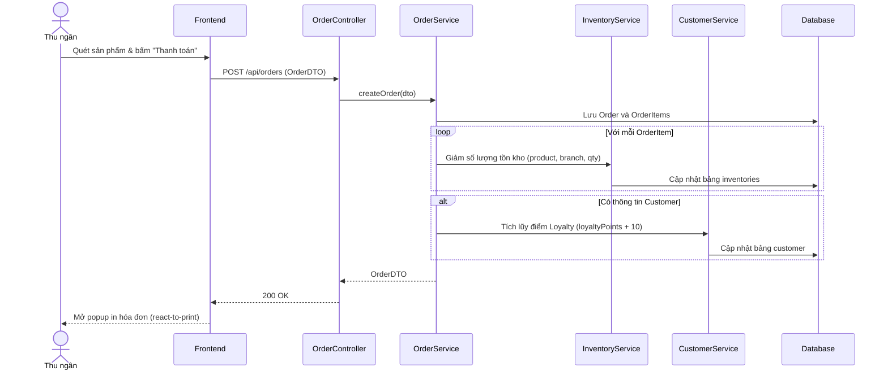

# TDD: Bán hàng tại quầy (Order & POS)

## 1. Tổng quan

Module Bán hàng tại quầy (POS) là cốt lõi của hoạt động thu ngân. Cho phép lựa chọn sản phẩm, tính tiền, áp dụng thông tin khách hàng, lưu đơn hàng và in hóa đơn tại quầy.

**Controller:** `OrderController.java`  
**Base URL:** `/api/orders`

---

## 2. API Endpoints

| # | Method | URL | Mô tả | Phân quyền |
|---|--------|-----|-------|------------|
| 1 | POST | `/api/orders` | Tạo đơn hàng mới | `ROLE_BRANCH_CASHIER` |
| 2 | GET | `/api/orders/{id}` | Lấy chi tiết đơn hàng | Public (Có JWT) |
| 3 | GET | `/api/orders/branch/{branchId}` | Lấy danh sách đơn hàng của chi nhánh (có bộ lọc) | Public (Có JWT) |
| 4 | GET | `/api/orders/cashier/{cashierId}` | Lấy danh sách đơn hàng do thu ngân bán | Public (Có JWT) |
| 5 | GET | `/api/orders/today/branch/{branchId}` | Lấy các đơn hàng trong ngày của chi nhánh | Public (Có JWT) |
| 6 | GET | `/api/orders/customer/{customerId}` | Lấy danh sách đơn hàng của một khách hàng | Public (Có JWT) |
| 7 | GET | `/api/orders/recent/{branchId}` | Lấy 5 đơn hàng gần đây nhất của chi nhánh | `ROLE_BRANCH_MANAGER`, `ROLE_BRANCH_ADMIN` |
| 8 | DELETE | `/api/orders/{id}` | Xóa đơn hàng | `ROLE_STORE_ADMIN`, `ROLE_STORE_MANAGER` |

---

## 3. Request / Response Schema

### 3.1 Tạo đơn hàng mới (POST `/api/orders`)

**Request Body (`OrderDTO`):**
```json
{
  "branchId": 1,
  "cashierId": 15,
  "customerId": 2,
  "paymentType": "CASH",
  "totalAmount": 15000.0,
  "items": [
    {
      "productId": 101,
      "quantity": 3,
      "price": 5000.0
    }
  ]
}
```

**Response (`OrderDTO`):**
```json
{
  "id": 5001,
  "branchId": 1,
  "cashierId": 15,
  "customerId": 2,
  "paymentType": "CASH",
  "totalAmount": 15000.0,
  "status": "COMPLETED",
  "items": [
    {
      "id": 8001,
      "productId": 101,
      "productName": "Nước khoáng Lavie 500ml",
      "quantity": 3,
      "price": 5000.0
    }
  ],
  "createdAt": "2026-06-29T22:25:00"
}
```

---

## 4. Database Schema

### 4.1 Bảng `orders`

| Trường | Kiểu | Ràng buộc | Mô tả |
|--------|------|-----------|-------|
| id | BIGINT | PK, IDENTITY | ID đơn hàng tự tăng |
| total_amount | DOUBLE | — | Tổng giá trị đơn hàng |
| payment_type | VARCHAR(50) | — | Phương thức (CASH, CARD, UPI) |
| status | VARCHAR(50) | — | Trạng thái (COMPLETED, REFUNDED) |
| branch_id | BIGINT | FK → branches.id | Chi nhánh thực hiện giao dịch |
| cashier_id | BIGINT | FK → users.id | Thu ngân bán hàng |
| customer_id | BIGINT | FK → customer.id | Khách hàng mua hàng |
| created_at | DATETIME | — | Thời gian tạo đơn hàng |

### 4.2 Bảng `order_items`

| Trường | Kiểu | Ràng buộc | Mô tả |
|--------|------|-----------|-------|
| id | BIGINT | PK | ID tự tăng |
| order_id | BIGINT | FK → orders.id | Thuộc hóa đơn nào |
| product_id | BIGINT | FK → products.id | Mã sản phẩm |
| quantity | INT | — | Số lượng mua |
| price | DOUBLE | — | Đơn giá tại thời điểm bán |

---

## 5. Sequence Diagram

### Luồng Bán hàng và Trừ Kho tại POS



---

## 6. Nghiệp vụ Phụ thuộc
- **Inventory Module:** Phụ thuộc để cập nhật số lượng tồn kho thực tế.
- **Customer Module:** Tích điểm thưởng cho khách hàng thân thiết.
- **Shift Report Module:** Tổng hợp đơn hàng vào báo cáo ca làm việc hiện tại của thu ngân.

---

## 7. Error Handling
- `OutOfStockException`: Báo lỗi nếu sản phẩm trong kho không đủ bán.
- `UserException`: Không tìm thấy thu ngân hoặc chi nhánh.

---

## 8. Test Cases
- **TC-01 (Happy Path):** Tạo hóa đơn thành công, trừ kho sản phẩm chính xác và điểm tích lũy khách hàng tăng.
- **TC-02 (Error Path):** Đặt hàng sản phẩm có số lượng bán lớn hơn tồn kho thực tế -> Hệ thống ném lỗi hết hàng.
- **TC-03 (Security Path):** Tài khoản `Store Admin` cố tạo đơn hàng trực tiếp -> Báo lỗi `403 Forbidden` (Chỉ thu ngân chi nhánh `ROLE_BRANCH_CASHIER` được tạo đơn).
