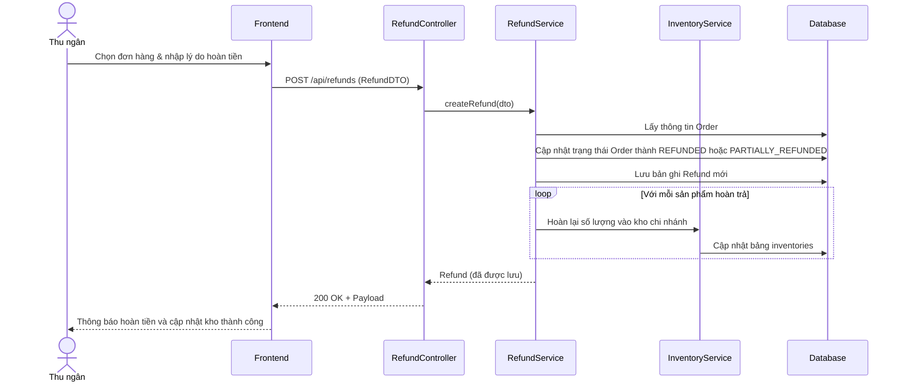

# TDD: Hoàn tiền (Refund)

## 1. Tổng quan

Module Hoàn tiền hỗ trợ xử lý trả hàng và hoàn tiền cho khách hàng khi giao dịch xảy ra lỗi hoặc khách hàng muốn trả lại sản phẩm.

**Controller:** `RefundController.java`  
**Base URL:** `/api/refunds`

---

## 2. API Endpoints

| # | Method | URL | Mô tả | Phân quyền |
|---|--------|-----|-------|------------|
| 1 | POST | `/api/refunds` | Tạo yêu cầu hoàn tiền mới | `ROLE_BRANCH_CASHIER` |
| 2 | GET | `/api/refunds` | Lấy tất cả yêu cầu hoàn tiền | `ROLE_STORE_ADMIN`, `ROLE_STORE_MANAGER` |
| 3 | GET | `/api/refunds/cashier/{cashierId}` | Lấy danh sách hoàn tiền do một thu ngân thực hiện | `ROLE_BRANCH_CASHIER`, `ROLE_BRANCH_MANAGER`, `ROLE_BRANCH_ADMIN` |
| 4 | GET | `/api/refunds/branch/{branchId}` | Lấy danh sách hoàn tiền của một chi nhánh | `ROLE_BRANCH_MANAGER`, `ROLE_BRANCH_ADMIN` |
| 5 | GET | `/api/refunds/shift/{shiftReportId}` | Lấy danh sách hoàn tiền theo ca làm việc | `ROLE_BRANCH_MANAGER`, `ROLE_BRANCH_ADMIN` |
| 6 | GET | `/api/refunds/cashier/{cashierId}/range` | Lấy danh sách hoàn tiền trong khoảng thời gian | `ROLE_BRANCH_CASHIER`, `ROLE_BRANCH_MANAGER`, `ROLE_BRANCH_ADMIN` |
| 7 | GET | `/api/refunds/{id}` | Lấy thông tin chi tiết một bản ghi hoàn tiền | Public (Có JWT) |
| 8 | DELETE | `/api/refunds/{id}` | Xóa yêu cầu hoàn tiền | `ROLE_BRANCH_ADMIN`, `ROLE_STORE_ADMIN` |

---

## 3. Request / Response Schema

### 3.1 Tạo yêu cầu hoàn tiền (POST `/api/refunds`)

**Request Body (`RefundDTO`):**
```json
{
  "orderId": 5001,
  "reason": "Khách đổi ý không mua nữa",
  "amount": 15000.0,
  "cashierId": 15,
  "branchId": 1,
  "paymentType": "CASH"
}
```

**Response (`RefundDTO`):**
```json
{
  "id": 901,
  "orderId": 5001,
  "reason": "Khách đổi ý không mua nữa",
  "amount": 15000.0,
  "cashierId": 15,
  "branchId": 1,
  "paymentType": "CASH",
  "createdAt": "2026-06-29T22:30:00"
}
```

---

## 4. Database Schema

### 4.1 Bảng `refund`

| Trường | Kiểu | Ràng buộc | Mô tả |
|--------|------|-----------|-------|
| id | BIGINT | PK, IDENTITY | ID tự tăng |
| order_id | BIGINT | FK → orders.id | Hóa đơn được hoàn |
| reason | VARCHAR(255) | — | Lý do hoàn tiền |
| amount | DOUBLE | — | Số tiền hoàn trả |
| shift_report_id | BIGINT | FK → shift_report.id | Thuộc ca làm việc nào |
| cashier_id | BIGINT | FK → users.id | Thu ngân thực hiện hoàn |
| branch_id | BIGINT | FK → branches.id | Chi nhánh thực hiện |
| payment_type | VARCHAR(50) | — | Hình thức hoàn (CASH, CARD, UPI) |
| created_at | DATETIME | — | Thời gian tạo |

---

## 5. Sequence Diagram

### Luồng Xử lý Hoàn tiền tại Chi nhánh



---

## 6. Nghiệp vụ Phụ thuộc
- **Order Module:** Hóa đơn được hoàn phải tồn tại trong hệ thống.
- **Inventory Module:** Khi hoàn tiền, sản phẩm được trả lại sẽ tự động cộng ngược trở lại kho của chi nhánh.
- **Shift Report Module:** Số tiền hoàn sẽ được trừ vào dòng tiền mặt (`totalRefunds` và `netSales`) của ca thu ngân đó.

---

## 7. Error Handling
- `ResourceNotFoundException`: Không tìm thấy đơn hàng hoặc chi nhánh liên quan.
- `UserException`: Lỗi xảy ra nếu số tiền hoàn vượt quá giá trị đơn hàng gốc.

---

## 8. Test Cases
- **TC-01 (Happy Path):** Hoàn tiền thành công, cập nhật số lượng tồn kho tăng lên, cập nhật hóa đơn.
- **TC-02 (Error Path):** Hoàn tiền số tiền lớn hơn tổng giá trị hóa đơn -> Trả về lỗi nghiệp vụ.
- **TC-03 (Security Path):** Tài khoản `Branch Manager` cố gọi API xóa bản ghi hoàn tiền -> Báo lỗi `403 Forbidden` (Chỉ Branch Admin hoặc Store Admin mới được phép xóa).
