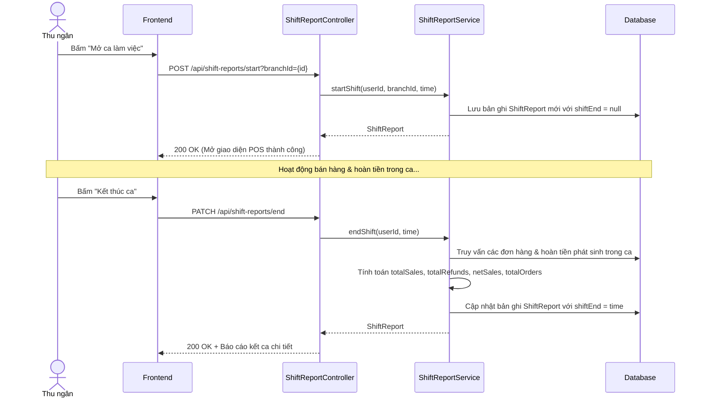

# TDD: Báo cáo Ca làm việc (Shift Report)

## 1. Tổng quan

Module Báo cáo Ca làm việc quản lý việc đóng/mở ca của thu ngân hàng ngày. Hỗ trợ đối chiếu tiền mặt đầu ca, tổng hợp doanh thu trong ca, số tiền hoàn và kết ca để xuất dữ liệu báo cáo bàn giao.

**Controller:** `ShiftReportController.java`  
**Base URL:** `/api/shift-reports`

---

## 2. API Endpoints

| # | Method | URL | Mô tả | Phân quyền |
|---|--------|-----|-------|------------|
| 1 | POST | `/api/shift-reports/start` | Bắt đầu ca làm việc mới | `ROLE_BRANCH_CASHIER` |
| 2 | PATCH | `/api/shift-reports/end` | Kết thúc ca làm việc hiện tại | `ROLE_BRANCH_CASHIER` |
| 3 | GET | `/api/shift-reports/current` | Lấy ca làm việc hiện tại của thu ngân | `ROLE_BRANCH_CASHIER` |
| 4 | GET | `/api/shift-reports/cashier/{cashierId}/by-date` | Lấy báo cáo ca của thu ngân theo ngày | `ROLE_BRANCH_CASHIER`, `ROLE_BRANCH_MANAGER`, `ROLE_BRANCH_ADMIN` |
| 5 | GET | `/api/shift-reports/cashier/{cashierId}` | Lấy danh sách ca làm việc của một thu ngân | `ROLE_BRANCH_CASHIER`, `ROLE_BRANCH_MANAGER`, `ROLE_BRANCH_ADMIN` |
| 6 | GET | `/api/shift-reports/branch/{branchId}` | Lấy danh sách ca làm việc tại một chi nhánh | `ROLE_BRANCH_MANAGER`, `ROLE_BRANCH_ADMIN` |
| 7 | GET | `/api/shift-reports` | Lấy tất cả ca làm việc trong hệ thống | `ROLE_STORE_ADMIN`, `ROLE_STORE_MANAGER` |
| 8 | GET | `/api/shift-reports/{id}` | Lấy chi tiết ca làm việc theo ID | Public (Có JWT) |
| 9 | DELETE | `/api/shift-reports/{id}` | Xóa ca làm việc | `ROLE_BRANCH_ADMIN`, `ROLE_STORE_ADMIN` |

---

## 3. Request / Response Schema

### 3.1 Bắt đầu ca mới (POST `/api/shift-reports/start?branchId=1`)

**Response (`ShiftReport`):**
```json
{
  "id": 12,
  "shiftStart": "2026-06-29T08:00:00",
  "shiftEnd": null,
  "totalSales": 0.0,
  "totalRefunds": 0.0,
  "netSales": 0.0,
  "totalOrders": 0,
  "cashier": {
    "id": 15,
    "fullName": "Trần Thị B"
  },
  "branch": {
    "id": 1,
    "name": "Chi nhánh Cầu Giấy"
  }
}
```

### 3.2 Kết thúc ca làm việc (PATCH `/api/shift-reports/end`)

**Response (`ShiftReportDTO`):**
```json
{
  "id": 12,
  "shiftStart": "2026-06-29T08:00:00",
  "shiftEnd": "2026-06-29T17:00:00",
  "totalSales": 1500000.0,
  "totalRefunds": 50000.0,
  "netSales": 1450000.0,
  "totalOrders": 25,
  "cashierId": 15,
  "branchId": 1
}
```

---

## 4. Database Schema

### 4.1 Bảng `shift_report`

| Trường | Kiểu | Ràng buộc | Mô tả |
|--------|------|-----------|-------|
| id | BIGINT | PK, IDENTITY | ID ca làm việc |
| shift_start | DATETIME | — | Thời điểm mở ca |
| shift_end | DATETIME | — | Thời điểm đóng ca |
| total_sales | DOUBLE | — | Tổng doanh thu phát sinh |
| total_refunds | DOUBLE | — | Tổng tiền đã hoàn trả |
| net_sales | DOUBLE | — | Doanh thu thực tế (sales - refunds) |
| total_orders | INT | — | Tổng số lượng đơn hàng |
| cashier_id | BIGINT | FK → users.id | Thu ngân thực hiện |
| branch_id | BIGINT | FK → branches.id | Chi nhánh hoạt động |

---

## 5. Sequence Diagram

### Luồng Vận hành Mở/Đóng ca làm việc của Thu ngân



---

## 6. Nghiệp vụ Phụ thuộc
- **Order & Refund Modules:** Doanh thu và số tiền hoàn trong ca được tính toán dựa trên dữ liệu các hóa đơn và các bản ghi hoàn tiền phát sinh từ thời điểm `shiftStart` đến `shiftEnd`.

---

## 7. Error Handling
- `UserException`: Báo lỗi nếu thu ngân cố mở ca mới khi ca cũ chưa đóng, hoặc kết thúc ca khi chưa mở ca nào.

---

## 8. Test Cases
- **TC-01 (Happy Path):** Mở ca thành công -> Trạng thái ca hiển thị hoạt động.
- **TC-02 (Happy Path):** Kết thúc ca thành công -> Dữ liệu dòng tiền và doanh số được tổng hợp chính xác.
- **TC-03 (Error Path):** Cố mở ca lần thứ 2 trong ngày khi ca trước đó chưa đóng -> Báo lỗi ca làm việc đang mở.
- **TC-04 (Security Path):** Tài khoản `Branch Manager` cố gọi API xóa ca làm việc -> Trả về lỗi `403 Forbidden` (Chỉ Branch Admin hoặc Store Admin mới được quyền xóa).
