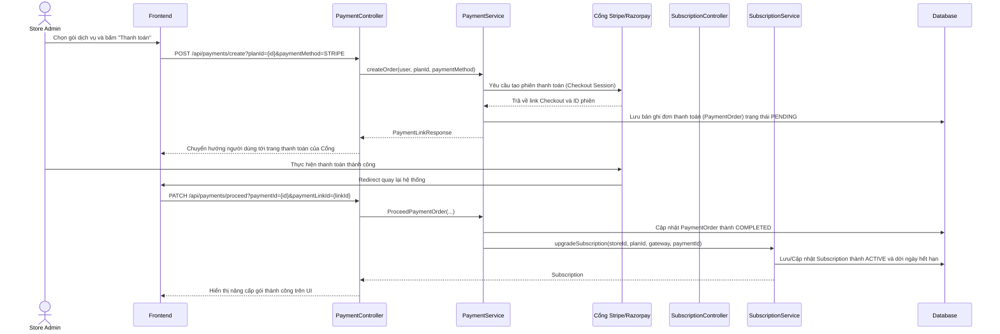

# TDD: Thanh toán & Gói dịch vụ (Payment & Subscription)

## 1. Tổng quan

Module Thanh toán & Gói dịch vụ quản lý các gói dịch vụ SaaS cung cấp cho Store và tích hợp cổng thanh toán trực tuyến (Stripe/Razorpay) để thực hiện thanh toán phí dịch vụ định kỳ.

**Controllers:** `PaymentController.java`, `SubscriptionController.java`, `SubscriptionPlanController.java`  
**Base URLs:** `/api/payments`, `/api/subscriptions`, `/api/super-admin/subscription-plans`

---

## 2. API Endpoints

### 2.1 Cổng Thanh toán (`/api/payments`)

| # | Method | URL | Mô tả | Phân quyền |
|---|--------|-----|-------|------------|
| 1 | POST | `/api/payments/create` | Tạo link thanh toán nâng cấp/gia hạn gói | `ROLE_STORE_ADMIN` |
| 2 | PATCH | `/api/payments/proceed` | Xác nhận giao dịch thanh toán thành công | Public (Webhook/Callback) |

### 2.2 Đăng ký Gói dịch vụ (`/api/subscriptions`)

| # | Method | URL | Mô tả | Phân quyền |
|---|--------|-----|-------|------------|
| 1 | POST | `/api/subscriptions/subscribe` | Đăng ký gói dùng thử hoặc gói mới | Public (Có JWT) |
| 2 | POST | `/api/subscriptions/upgrade` | Nâng cấp gói dịch vụ hiện tại | Public (Có JWT) |
| 3 | PUT | `/api/subscriptions/{id}/activate` | Kích hoạt gói dịch vụ thủ công | `ROLE_ADMIN` (Super Admin) |
| 4 | PUT | `/api/subscriptions/{id}/cancel` | Hủy gói dịch vụ | `ROLE_ADMIN` (Super Admin) |
| 5 | GET | `/api/subscriptions/store/{storeId}` | Lấy lịch sử đăng ký gói của cửa hàng | Public (Có JWT) |
| 6 | GET | `/api/subscriptions/admin` | Xem tất cả đăng ký gói | `ROLE_ADMIN` (Super Admin) |

### 2.3 Cấu hình Gói (Super Admin)

| # | Method | URL | Mô tả | Phân quyền |
|---|--------|-----|-------|------------|
| 1 | POST | `/api/super-admin/subscription-plans` | Tạo gói dịch vụ mới | `ROLE_ADMIN` (Super Admin) |
| 2 | PUT | `/api/super-admin/subscription-plans/{id}` | Cập nhật thông tin gói dịch vụ | `ROLE_ADMIN` (Super Admin) |
| 3 | DELETE | `/api/super-admin/subscription-plans/{id}` | Xóa gói dịch vụ | `ROLE_ADMIN` (Super Admin) |

---

## 3. Request / Response Schema

### 3.1 Tạo Link Thanh toán (POST `/api/payments/create?planId=2&paymentMethod=STRIPE`)

**Response (`PaymentLinkResponse`):**
```json
{
  "payment_link_url": "https://checkout.stripe.com/pay/cs_test_a1b2c3...",
  "payment_link_id": "plink_12345"
}
```

### 3.2 Đăng ký gói (POST `/api/subscriptions/subscribe`)

**Parameters:** `storeId=1`, `planId=2`, `gateway=STRIPE`

**Response (`Subscription`):**
```json
{
  "id": 8,
  "store": {
    "id": 1,
    "brand": "D Mart HN"
  },
  "plan": {
    "id": 2,
    "name": "Standard Plan",
    "price": 199.0
  },
  "startDate": "2026-06-29",
  "endDate": "2026-07-29",
  "status": "ACTIVE",
  "paymentStatus": "COMPLETED",
  "paymentGateway": "STRIPE",
  "transactionId": "ch_12345"
}
```

---

## 4. Database Schema

### 4.1 Bảng `subscription_plans`

| Trường | Kiểu | Ràng buộc | Mô tả |
|--------|------|-----------|-------|
| id | BIGINT | PK, IDENTITY | ID gói dịch vụ |
| name | VARCHAR(255) | NOT NULL | Tên gói (Trial, Standard, Pro) |
| price | DOUBLE | NOT NULL | Phí đăng ký |
| billing_cycle | VARCHAR(50) | NOT NULL | Chu kỳ (MONTHLY, YEARLY) |
| max_branches | INT | NOT NULL | Số chi nhánh tối đa |
| max_users | INT | NOT NULL | Số nhân viên tối đa |
| max_products | INT | NOT NULL | Số sản phẩm tối đa |
| active | BOOLEAN | NOT NULL | Trạng thái kích hoạt |

### 4.2 Bảng `subscriptions`

| Trường | Kiểu | Ràng buộc | Mô tả |
|--------|------|-----------|-------|
| id | BIGINT | PK, IDENTITY | ID đăng ký |
| store_id | BIGINT | FK → stores.id | Store sở hữu đăng ký |
| plan_id | BIGINT | FK → subscription_plans.id | Gói đăng ký |
| start_date | DATE | NOT NULL | Ngày bắt đầu |
| end_date | DATE | NOT NULL | Ngày hết hạn |
| status | VARCHAR(50) | — | Trạng thái (TRIAL, ACTIVE, EXPIRED, CANCELLED) |
| payment_status | VARCHAR(50) | — | Trạng thái thanh toán |
| payment_gateway | VARCHAR(50) | — | Cổng thanh toán (STRIPE, RAZORPAY) |
| transaction_id | VARCHAR(255) | — | Mã giao dịch từ cổng thanh toán |

---

## 5. Sequence Diagram

### Luồng Đăng ký và Thanh toán Gói dịch vụ



---

## 6. Nghiệp vụ Phụ thuộc
- **Store Module:** Mọi đăng ký gói (Subscription) thuộc về thực thể `Store`.
- **System Limits:** Các giới hạn của gói (`maxBranches`, `maxUsers`, `maxProducts`) được kiểm tra trước khi Store Admin tạo thêm chi nhánh, nhân sự hoặc sản phẩm.

---

## 7. Error Handling
- `StripeException` / `RazorpayException`: Lỗi kết nối hoặc xử lý giao dịch từ phía cổng thanh toán.
- `UserException`: Không tìm thấy Store hoặc Plan.

---

## 8. Test Cases
- **TC-01 (Happy Path):** Tạo link thanh toán thành công cho gói Pro.
- **TC-02 (Happy Path):** Xác nhận thanh toán thành công chuyển trạng thái đăng ký sang `ACTIVE`.
- **TC-03 (Security Path):** Nhân viên thu ngân (Cashier) gửi request thanh toán dịch vụ -> Báo lỗi `403 Forbidden`.
