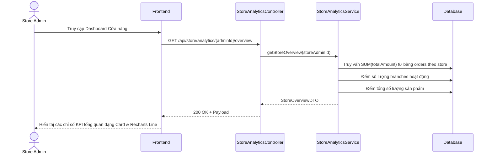

# TDD: Thống kê & Báo cáo (Analytics & Reports)

## 1. Tổng quan

Module Thống kê & Báo cáo xử lý việc tổng hợp dữ liệu giao dịch bán hàng, doanh thu, cơ cấu mặt hàng bán chạy và hiệu suất nhân viên. Phục vụ hiển thị biểu đồ phân tích trực quan ở cả cấp cửa hàng (Store) và chi nhánh (Branch).

**Controllers:** `BranchAnalyticsController.java`, `StoreAnalyticsController.java`, `AdminDashboardController.java`  
**Base URLs:** `/api/branch-analytics`, `/api/store/analytics`, `/api/super-admin`

---

## 2. API Endpoints

### 2.1 Thống kê Chi nhánh (`/api/branch-analytics`)

| # | Method | URL | Mô tả | Phân quyền |
|---|--------|-----|-------|------------|
| 1 | GET | `/api/branch-analytics/daily-sales` | Lấy doanh thu hàng ngày của chi nhánh | `ROLE_BRANCH_MANAGER`, `ROLE_BRANCH_ADMIN` |
| 2 | GET | `/api/branch-analytics/top-products` | Top 5 sản phẩm bán chạy nhất tại chi nhánh | `ROLE_BRANCH_MANAGER`, `ROLE_BRANCH_ADMIN` |
| 3 | GET | `/api/branch-analytics/top-cashiers` | Hiệu suất doanh thu của các thu ngân | `ROLE_BRANCH_MANAGER`, `ROLE_BRANCH_ADMIN` |
| 4 | GET | `/api/branch-analytics/category-sales` | Phân tích doanh số theo danh mục | `ROLE_BRANCH_MANAGER`, `ROLE_BRANCH_ADMIN` |
| 5 | GET | `/api/branch-analytics/today-overview` | Số liệu tổng quan ngày hôm nay của chi nhánh | `ROLE_BRANCH_MANAGER`, `ROLE_BRANCH_ADMIN` |
| 6 | GET | `/api/branch-analytics/payment-breakdown` | Phân chia doanh số theo phương thức thanh toán | `ROLE_BRANCH_MANAGER`, `ROLE_BRANCH_ADMIN` |

### 2.2 Thống kê Cửa hàng (`/api/store/analytics`)

| # | Method | URL | Mô tả | Phân quyền |
|---|--------|-----|-------|------------|
| 1 | GET | `/api/store/analytics/{storeAdminId}/overview` | Số liệu KPI tổng quan của Store | Public (Có JWT) |
| 2 | GET | `/api/store/analytics/{storeAdminId}/sales-trends` | Xu hướng doanh số theo chu kỳ (ngày/tuần/tháng) | Public (Có JWT) |
| 3 | GET | `/api/store/analytics/{storeAdminId}/sales/monthly` | Doanh thu theo các tháng | Public (Có JWT) |
| 4 | GET | `/api/store/analytics/{storeAdminId}/sales/daily` | Doanh thu theo các ngày trong tháng | Public (Có JWT) |
| 5 | GET | `/api/store/analytics/{storeAdminId}/sales/category` | Doanh thu Store theo danh mục sản phẩm | Public (Có JWT) |
| 6 | GET | `/api/store/analytics/{storeAdminId}/sales/payment-method` | Phân tích thanh toán toàn Store | Public (Có JWT) |
| 7 | GET | `/api/store/analytics/{storeAdminId}/sales/branch` | So sánh doanh thu giữa các chi nhánh | Public (Có JWT) |
| 8 | GET | `/api/store/analytics/{storeAdminId}/branch-performance` | Phân tích hiệu suất chi nhánh | Public (Có JWT) |

### 2.3 Thống kê Super Admin (`/api/super-admin`)

| # | Method | URL | Mô tả | Phân quyền |
|---|--------|-----|-------|------------|
| 1 | GET | `/api/super-admin/dashboard/summary` | Thống kê số lượng Store đăng ký trong hệ thống | `ROLE_ADMIN` (Super Admin) |
| 2 | GET | `/api/super-admin/dashboard/store-registrations` | Tỷ lệ đăng ký Store mới 7 ngày qua | `ROLE_ADMIN` (Super Admin) |
| 3 | GET | `/api/super-admin/dashboard/store-status-distribution` | Phân bố trạng thái cửa hàng (Active/Blocked/Pending) | `ROLE_ADMIN` (Super Admin) |

---

## 3. Request / Response Schema

### 3.1 Báo cáo Tổng quan Chi nhánh hôm nay (GET `/api/branch-analytics/today-overview?branchId=1`)

**Response (`BranchDashboardOverviewDTO`):**
```json
{
  "todaySales": 1250000.0,
  "todayOrders": 15,
  "todayRefunds": 0.0,
  "activeCashiersCount": 3,
  "averageOrderValue": 83333.33,
  "salesGrowthPercentage": 12.5
}
```

### 3.2 Top 5 Sản phẩm Chi nhánh (GET `/api/branch-analytics/top-products?branchId=1`)

**Response (`List<ProductPerformanceDTO>`):**
```json
[
  {
    "productId": 101,
    "productName": "Nước khoáng Lavie 500ml",
    "quantitySold": 50,
    "totalRevenue": 250000.0,
    "contributionPercentage": 20.0
  }
]
```

---

## 4. Sequence Diagram

### Luồng Tổng hợp và Hiển thị Thống kê trên Dashboard



---

## 5. Nghiệp vụ Phụ thuộc
- **Order Module:** Thống kê doanh số, số đơn hàng lấy trực tiếp từ dữ liệu giao dịch hóa đơn.
- **Refund Module:** Số tiền hoàn trả được sử dụng để tính doanh thu thuần (Net Sales).

---

## 6. Test Cases
- **TC-01 (Happy Path):** Lấy dữ liệu biểu đồ doanh thu hàng ngày thành công mà không có lỗi format ngày tháng.
- **TC-02 (Happy Path):** Trả về danh sách rỗng thay vì lỗi 500 nếu chi nhánh chưa phát sinh đơn hàng nào.
- **TC-03 (Security Path):** Tài khoản thu ngân (Cashier) truy cập thống kê chi nhánh -> Báo lỗi `403 Forbidden` (Chỉ Manager/Admin được xem báo cáo phân tích).
