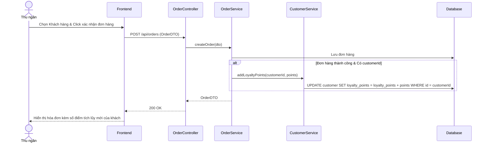

# TDD: Quản lý Khách hàng (Customer Management)

## 1. Tổng quan

Module Quản lý Khách hàng lưu giữ thông tin khách hàng thân thiết, phục vụ việc truy xuất nhanh khi thanh toán tại quầy POS và quản lý chương trình tích lũy điểm thưởng (Loyalty Points).

**Controller:** `CustomerController.java`  
**Base URL:** `/api/customers`

---

## 2. API Endpoints

| # | Method | URL | Mô tả | Phân quyền |
|---|--------|-----|-------|------------|
| 1 | POST | `/api/customers` | Tạo khách hàng mới | Public (Có JWT) |
| 2 | PUT | `/api/customers/{id}` | Cập nhật thông tin khách hàng | Public (Có JWT) |
| 3 | DELETE | `/api/customers/{id}` | Xóa khách hàng | Public (Có JWT) |
| 4 | GET | `/api/customers/{id}` | Lấy chi tiết thông tin khách hàng | Public (Có JWT) |
| 5 | GET | `/api/customers` | Lấy danh sách toàn bộ khách hàng | Public (Có JWT) |
| 6 | GET | `/api/users/customer` | Lấy danh sách tài khoản người dùng có vai trò khách hàng | Public (Có JWT) |

---

## 3. Request / Response Schema

### 3.1 Tạo khách hàng mới (POST `/api/customers`)

**Request Body (`Customer`):**
```json
{
  "fullName": "Phạm Văn C",
  "email": "customer.c@email.com",
  "phone": "0987111222"
}
```

**Response (`Customer`):**
```json
{
  "id": 201,
  "fullName": "Phạm Văn C",
  "email": "customer.c@email.com",
  "phone": "0987111222",
  "loyaltyPoints": 0,
  "createdAt": "2026-06-29T22:35:00",
  "updatedAt": "2026-06-29T22:35:00"
}
```

---

## 4. Database Schema

### 4.1 Bảng `customer`

| Trường | Kiểu | Ràng buộc | Mô tả |
|--------|------|-----------|-------|
| id | BIGINT | PK, IDENTITY | ID khách hàng tự tăng |
| full_name | VARCHAR(255) | NOT NULL | Tên khách hàng |
| email | VARCHAR(255) | — | Email liên hệ |
| phone | VARCHAR(255) | — | Số điện thoại |
| loyalty_points | INT | DEFAULT 0 | Điểm thưởng tích lũy |
| created_at | DATETIME | — | Ngày tạo bản ghi |
| updated_at | DATETIME | — | Ngày cập nhật |

---

## 5. Sequence Diagram

### Luồng Tích lũy Điểm thưởng Khách hàng



---

## 6. Nghiệp vụ Phụ thuộc
- **Order Module:** Điểm loyalty tự động được tích lũy dựa vào giá trị thanh toán của hóa đơn sau khi hoàn tất giao dịch.

---

## 7. Error Handling
- `ResourceNotFoundException`: Không tìm thấy khách hàng với ID yêu cầu.
- `ConstraintViolationException`: Lỗi xảy ra nếu bỏ trống tên khách hàng khi tạo mới.

---

## 8. Test Cases
- **TC-01 (Happy Path):** Tạo khách hàng mới thành công với các trường hợp thông tin hợp lệ.
- **TC-02 (Happy Path):** Trích xuất danh sách khách hàng đầy đủ tại giao diện bán hàng POS nhanh chóng.
- **TC-03 (Logic Path):** Điểm tích lũy loyalty của khách tăng chuẩn xác khi hoàn tất mua sắm hóa đơn.
