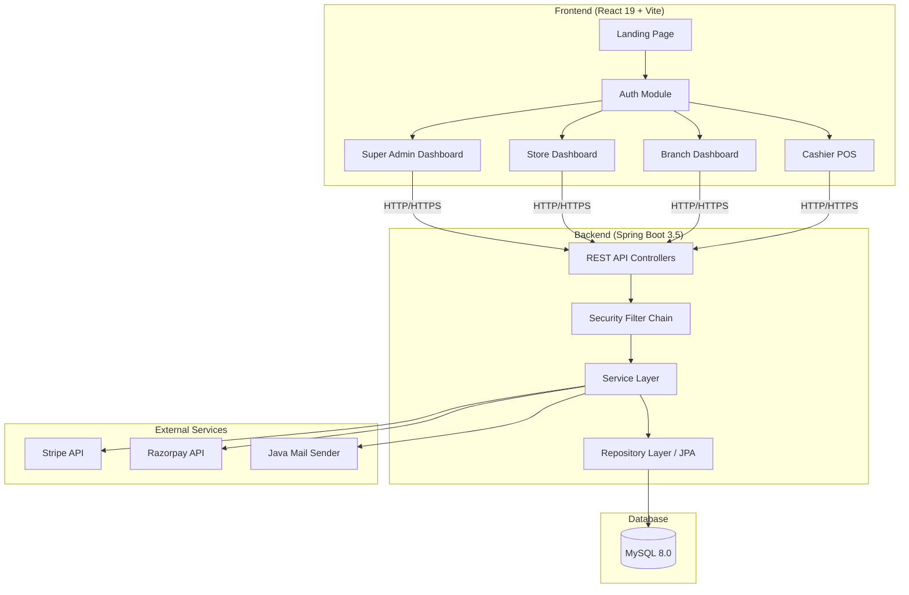
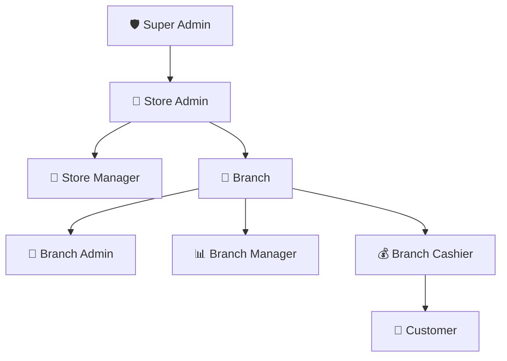
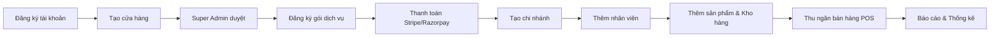
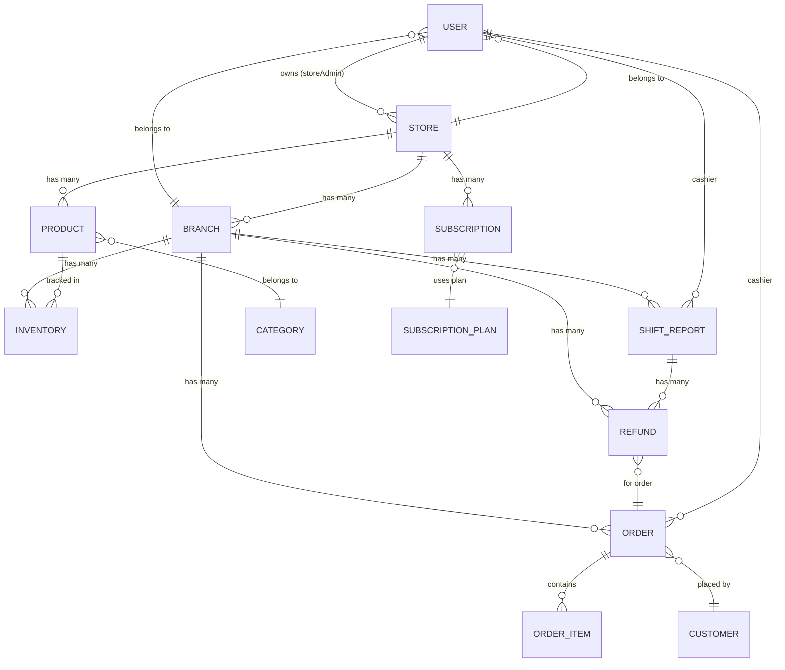

# Đặc tả Yêu cầu Phần mềm (SRS)
## DMart POS — Hệ sinh thái Quản lý Bán hàng SaaS

---

## 1. Giới thiệu

### 1.1 Mục đích
Tài liệu này mô tả chi tiết các yêu cầu chức năng và phi chức năng của hệ thống **DMart POS** — một nền tảng SaaS (Software as a Service) quản lý bán hàng tại quầy (Point of Sale) dành cho mô hình bán lẻ đa chi nhánh.

### 1.2 Phạm vi
Hệ thống bao gồm:
- **Backend API**: RESTful API xây dựng trên Spring Boot 3.5, Java 21
- **Frontend SPA**: React 19 (Vite), TypeScript/JavaScript
- **Database**: MySQL 8.0
- **Tích hợp thanh toán**: Stripe & Razorpay
- **Bảo mật**: JWT Stateless + RBAC (Role-Based Access Control)

### 1.3 Đối tượng sử dụng
| Vai trò | Mô tả |
|---------|-------|
| **Super Admin (ROLE_ADMIN)** | Quản trị viên hệ thống tổng — quản lý toàn bộ cửa hàng, duyệt/từ chối đăng ký |
| **Store Admin (ROLE_STORE_ADMIN)** | Chủ chuỗi cửa hàng — tạo cửa hàng, quản lý chi nhánh, đăng ký gói dịch vụ, thanh toán |
| **Store Manager (ROLE_STORE_MANAGER)** | Quản lý cửa hàng — quản lý sản phẩm, danh mục, kho hàng, nhân viên cấp cửa hàng |
| **Branch Admin (ROLE_BRANCH_ADMIN)** | Quản trị viên chi nhánh — quản lý nhân sự và dữ liệu tại chi nhánh |
| **Branch Manager (ROLE_BRANCH_MANAGER)** | Cửa hàng trưởng — giám sát doanh thu, ca làm việc, đơn hàng tại chi nhánh |
| **Branch Cashier (ROLE_BRANCH_CASHIER)** | Thu ngân — bán hàng tại quầy POS, quản lý ca làm việc, xử lý hoàn tiền |
| **Customer (ROLE_CUSTOMER)** | Khách hàng — tích điểm thưởng |

### 1.4 Định nghĩa & Từ viết tắt
| Thuật ngữ | Ý nghĩa |
|-----------|---------|
| POS | Point of Sale — Điểm bán hàng |
| SaaS | Software as a Service — Phần mềm dạng dịch vụ |
| JWT | JSON Web Token — Token xác thực |
| RBAC | Role-Based Access Control — Kiểm soát truy cập dựa trên vai trò |
| SKU | Stock Keeping Unit — Mã quản lý tồn kho |
| MRP | Maximum Retail Price — Giá bán lẻ tối đa |
| TDD | Technical Design Document — Tài liệu thiết kế kỹ thuật |

---

## 2. Mô tả Tổng quan Hệ thống

### 2.1 Kiến trúc Hệ thống

### 2.2 Mô hình Phân cấp Tổ chức

### 2.3 Luồng Nghiệp vụ Chính

---

## 3. Yêu cầu Chức năng

### 3.1 Module Xác thực (Authentication)
| ID | Yêu cầu | Mô tả |
|----|----------|-------|
| FR-AUTH-01 | Đăng ký tài khoản | Người dùng mới có thể đăng ký với email, mật khẩu, họ tên |
| FR-AUTH-02 | Đăng nhập | Xác thực bằng email + mật khẩu, trả về JWT token |
| FR-AUTH-03 | Quên mật khẩu | Gửi link reset mật khẩu qua email |
| FR-AUTH-04 | Đặt lại mật khẩu | Xác minh token và đặt mật khẩu mới |

### 3.2 Module Phân quyền (Authorization)
| ID | Yêu cầu | Mô tả |
|----|----------|-------|
| FR-AUTHZ-01 | RBAC 7 vai trò | Hệ thống hỗ trợ 7 vai trò phân cấp từ Super Admin đến Customer |
| FR-AUTHZ-02 | JWT Stateless | Mỗi request mang theo Bearer token trong header Authorization |
| FR-AUTHZ-03 | Endpoint Protection | API endpoints được bảo vệ bởi @PreAuthorize annotation |

### 3.3 Module Quản lý Cửa hàng (Store Management)
| ID | Yêu cầu | Mô tả |
|----|----------|-------|
| FR-STORE-01 | Tạo cửa hàng | Store Admin tạo cửa hàng mới (brand, mô tả, loại, liên hệ) |
| FR-STORE-02 | Cập nhật thông tin | Chỉnh sửa thông tin cửa hàng |
| FR-STORE-03 | Xóa cửa hàng | Xóa cửa hàng (cascade) |
| FR-STORE-04 | Duyệt/Từ chối | Super Admin duyệt hoặc từ chối cửa hàng mới đăng ký |
| FR-STORE-05 | Thêm nhân viên | Store Admin/Manager thêm nhân viên cấp cửa hàng |

### 3.4 Module Quản lý Chi nhánh (Branch Management)
| ID | Yêu cầu | Mô tả |
|----|----------|-------|
| FR-BRANCH-01 | Tạo chi nhánh | Store Admin tạo chi nhánh mới (tên, địa chỉ, SĐT, giờ hoạt động) |
| FR-BRANCH-02 | Cập nhật chi nhánh | Sửa thông tin chi nhánh |
| FR-BRANCH-03 | Xóa chi nhánh | Xóa chi nhánh và dữ liệu liên quan |
| FR-BRANCH-04 | Danh sách chi nhánh | Lấy tất cả chi nhánh theo store ID |

### 3.5 Module Quản lý Nhân viên (Employee Management)
| ID | Yêu cầu | Mô tả |
|----|----------|-------|
| FR-EMP-01 | Tạo nhân viên cửa hàng | Store Admin/Manager tạo nhân viên cấp cửa hàng (Store Manager) |
| FR-EMP-02 | Tạo nhân viên chi nhánh | Branch Admin/Manager tạo nhân viên chi nhánh (Branch Manager, Cashier) |
| FR-EMP-03 | Cập nhật nhân viên | Sửa thông tin nhân viên |
| FR-EMP-04 | Xóa nhân viên | Xóa nhân viên (chỉ Admin/Manager cấp tương ứng) |
| FR-EMP-05 | Danh sách nhân viên | Lọc nhân viên theo store hoặc branch |

### 3.6 Module Sản phẩm & Danh mục (Product & Category)
| ID | Yêu cầu | Mô tả |
|----|----------|-------|
| FR-PROD-01 | Tạo sản phẩm | Store Admin/Manager tạo sản phẩm (tên, SKU, giá MRP, giá bán, hình ảnh) |
| FR-PROD-02 | Cập nhật sản phẩm | Sửa thông tin sản phẩm |
| FR-PROD-03 | Xóa sản phẩm | Xóa sản phẩm khỏi cửa hàng |
| FR-PROD-04 | Tìm kiếm sản phẩm | Tìm sản phẩm theo từ khóa trong phạm vi cửa hàng |
| FR-CAT-01 | CRUD Danh mục | Tạo, đọc, sửa, xóa danh mục sản phẩm |

### 3.7 Module Kho hàng (Inventory)
| ID | Yêu cầu | Mô tả |
|----|----------|-------|
| FR-INV-01 | Tạo bản ghi kho | Gắn sản phẩm với chi nhánh cùng số lượng tồn kho |
| FR-INV-02 | Cập nhật số lượng | Điều chỉnh số lượng tồn kho |
| FR-INV-03 | Xóa bản ghi kho | Xóa bản ghi inventory |
| FR-INV-04 | Xem kho theo chi nhánh | Lấy danh sách tồn kho của chi nhánh cụ thể |

### 3.8 Module Bán hàng tại quầy (Order & POS)
| ID | Yêu cầu | Mô tả |
|----|----------|-------|
| FR-ORDER-01 | Tạo đơn hàng | Cashier tạo đơn hàng với danh sách sản phẩm, khách hàng, phương thức thanh toán |
| FR-ORDER-02 | Xem đơn hàng | Xem chi tiết đơn hàng theo ID |
| FR-ORDER-03 | Lọc đơn hàng | Lọc theo chi nhánh, thu ngân, khách hàng, phương thức thanh toán, trạng thái |
| FR-ORDER-04 | Đơn hàng hôm nay | Lấy danh sách đơn hàng trong ngày theo chi nhánh |
| FR-ORDER-05 | Xóa đơn hàng | Store Admin/Manager xóa đơn hàng |

### 3.9 Module Hoàn tiền (Refund)
| ID | Yêu cầu | Mô tả |
|----|----------|-------|
| FR-REF-01 | Tạo yêu cầu hoàn tiền | Cashier tạo yêu cầu hoàn tiền cho đơn hàng |
| FR-REF-02 | Xem hoàn tiền theo chi nhánh | Branch Admin/Manager xem danh sách hoàn tiền |
| FR-REF-03 | Xem hoàn tiền theo ca | Xem hoàn tiền trong ca làm việc cụ thể |
| FR-REF-04 | Xóa hoàn tiền | Chỉ Branch Admin hoặc Store Admin |

### 3.10 Module Báo cáo Ca làm việc (Shift Report)
| ID | Yêu cầu | Mô tả |
|----|----------|-------|
| FR-SHIFT-01 | Bắt đầu ca | Cashier mở ca làm việc mới (1 ca/ngày) |
| FR-SHIFT-02 | Kết thúc ca | Cashier đóng ca, hệ thống tổng hợp doanh số |
| FR-SHIFT-03 | Xem ca hiện tại | Cashier theo dõi tiến trình ca đang mở |
| FR-SHIFT-04 | Lịch sử ca | Xem lịch sử ca theo ngày, theo thu ngân, theo chi nhánh |
| FR-SHIFT-05 | Xóa ca | Chỉ Branch Admin hoặc Store Admin |

### 3.11 Module Thanh toán & Gói dịch vụ (Payment & Subscription)
| ID | Yêu cầu | Mô tả |
|----|----------|-------|
| FR-PAY-01 | Tạo link thanh toán | Store Admin tạo link thanh toán qua Stripe/Razorpay |
| FR-PAY-02 | Xử lý thanh toán | Xác nhận thanh toán thành công và kích hoạt gói |
| FR-SUB-01 | Đăng ký gói | Store đăng ký gói dịch vụ (Trial/Paid) |
| FR-SUB-02 | Nâng cấp gói | Nâng cấp lên gói cao hơn |
| FR-SUB-03 | Quản lý gói (Super Admin) | Super Admin tạo/sửa/xóa các gói dịch vụ |

### 3.12 Module Thống kê & Báo cáo (Analytics & Reports)
| ID | Yêu cầu | Mô tả |
|----|----------|-------|
| FR-ANA-01 | Dashboard Super Admin | Tổng quan cửa hàng, thống kê đăng ký 7 ngày, phân bổ trạng thái |
| FR-ANA-02 | Dashboard Store | Tổng quan KPI, doanh số theo tháng/ngày, theo danh mục, theo chi nhánh |
| FR-ANA-03 | Dashboard Chi nhánh | Doanh số hàng ngày, top sản phẩm, top thu ngân, phân loại thanh toán |

### 3.13 Module Quản lý Khách hàng (Customer Management)
| ID | Yêu cầu | Mô tả |
|----|----------|-------|
| FR-CUST-01 | Tạo khách hàng | Thêm khách hàng mới (họ tên, email, SĐT) |
| FR-CUST-02 | Cập nhật khách hàng | Sửa thông tin khách hàng |
| FR-CUST-03 | Tích điểm thưởng | Hệ thống tích lũy điểm loyalty cho khách hàng |
| FR-CUST-04 | Xóa khách hàng | Xóa khách hàng khỏi hệ thống |

---

## 4. Yêu cầu Phi chức năng

### 4.1 Hiệu suất
- API response time < 500ms cho các truy vấn thông thường
- Hỗ trợ concurrent users theo gói dịch vụ đã đăng ký

### 4.2 Bảo mật
- JWT token cho xác thực stateless
- Mật khẩu được mã hóa bằng BCrypt
- RBAC với 7 cấp vai trò
- CORS configuration cho phép frontend truy cập
- Tất cả input được validate trước khi xử lý

### 4.3 Khả năng mở rộng
- Kiến trúc multi-tenant (mỗi cửa hàng là 1 tenant)
- Database schema hỗ trợ phân tách dữ liệu theo store/branch
- Gói dịch vụ giới hạn số lượng chi nhánh, nhân viên, sản phẩm

### 4.4 Khả dụng
- Ứng dụng web responsive hoạt động trên mọi trình duyệt hiện đại
- Backend stateless cho phép horizontal scaling

### 4.5 Quốc tế hóa (i18n)
- Frontend hỗ trợ đa ngôn ngữ thông qua i18next
- Hiện tại hỗ trợ: Tiếng Việt, Tiếng Anh

---

## 5. Database Schema Tổng quan

### 5.1 Danh sách Entities

| Entity | Bảng DB | Mô tả |
|--------|---------|-------|
| User | `users` | Người dùng hệ thống (tất cả vai trò) |
| Store | `stores` | Cửa hàng / Chuỗi bán lẻ |
| StoreContact | (Embedded) | Thông tin liên hệ cửa hàng |
| Branch | `branches` | Chi nhánh thuộc cửa hàng |
| Product | `products` | Sản phẩm |
| Category | `categories` | Danh mục sản phẩm |
| Inventory | `inventories` | Tồn kho theo chi nhánh |
| Order | `orders` | Đơn hàng |
| OrderItem | `order_items` | Chi tiết đơn hàng |
| Customer | `customer` | Khách hàng |
| Refund | `refund` | Hoàn tiền |
| ShiftReport | `shift_report` | Báo cáo ca làm việc |
| Subscription | `subscriptions` | Đăng ký gói dịch vụ |
| SubscriptionPlan | `subscription_plans` | Các gói dịch vụ SaaS |
| PaymentOrder | `payment_order` | Đơn thanh toán |
| PaymentSummary | (Transient) | Tổng hợp thanh toán |
| PasswordResetToken | `password_reset_token` | Token đặt lại mật khẩu |

### 5.2 Sơ đồ Quan hệ (ER Diagram)

---

## 6. Tech Stack Chi tiết

### 6.1 Backend
| Thành phần | Công nghệ | Phiên bản |
|------------|-----------|-----------|
| Ngôn ngữ | Java | 21 |
| Framework | Spring Boot | 3.5+ |
| ORM | Spring Data JPA / Hibernate | — |
| Database | MySQL | 8.0 |
| Bảo mật | Spring Security + JWT | — |
| Thanh toán | Stripe SDK + Razorpay SDK | — |
| Email | Java Mail Sender | — |
| Build | Maven + JIB (Docker-less builds) | — |
| Mapping | MapStruct / Custom Mappers | — |

### 6.2 Frontend
| Thành phần | Công nghệ | Phiên bản |
|------------|-----------|-----------|
| Framework | React | 19 |
| Build Tool | Vite | — |
| Styling | Tailwind CSS | 4 |
| UI Components | Radix UI (Shadcn/UI) | — |
| State Management | Redux Toolkit | — |
| Routing | React Router | 7 |
| Form Validation | Zod + React Hook Form | — |
| Animation | Framer Motion | — |
| Icons | Lucide Icons | — |
| i18n | i18next | — |
| Charts | Recharts | — |
| Print | react-to-print | — |

---

## 7. Tham chiếu Tài liệu Kỹ thuật Chi tiết

Xem tài liệu TDD chi tiết cho từng feature tại các thư mục con:

| # | Feature | Đường dẫn |
|---|---------|-----------|
| 01 | Xác thực (Authentication) | [01-authentication/](./01-authentication/) |
| 02 | Phân quyền (Authorization) | [02-authorization/](./02-authorization/) |
| 03 | Quản lý Cửa hàng | [03-store-management/](./03-store-management/) |
| 04 | Quản lý Chi nhánh | [04-branch-management/](./04-branch-management/) |
| 05 | Quản lý Nhân viên | [05-employee-management/](./05-employee-management/) |
| 06 | Sản phẩm & Danh mục | [06-product-category/](./06-product-category/) |
| 07 | Kho hàng | [07-inventory/](./07-inventory/) |
| 08 | Bán hàng POS | [08-order-pos/](./08-order-pos/) |
| 09 | Hoàn tiền | [09-refund/](./09-refund/) |
| 10 | Báo cáo Ca làm việc | [10-shift-report/](./10-shift-report/) |
| 11 | Thanh toán & Gói dịch vụ | [11-payment-subscription/](./11-payment-subscription/) |
| 12 | Thống kê & Báo cáo | [12-analytics-reports/](./12-analytics-reports/) |
| 13 | Quản lý Khách hàng | [13-customer-management/](./13-customer-management/) |

---

## 8. Lịch sử Phiên bản

| Phiên bản | Ngày | Mô tả |
|-----------|------|-------|
| 1.0 | 2026-06-29 | Bản đặc tả yêu cầu đầu tiên, dựa trên codebase hiện tại |
